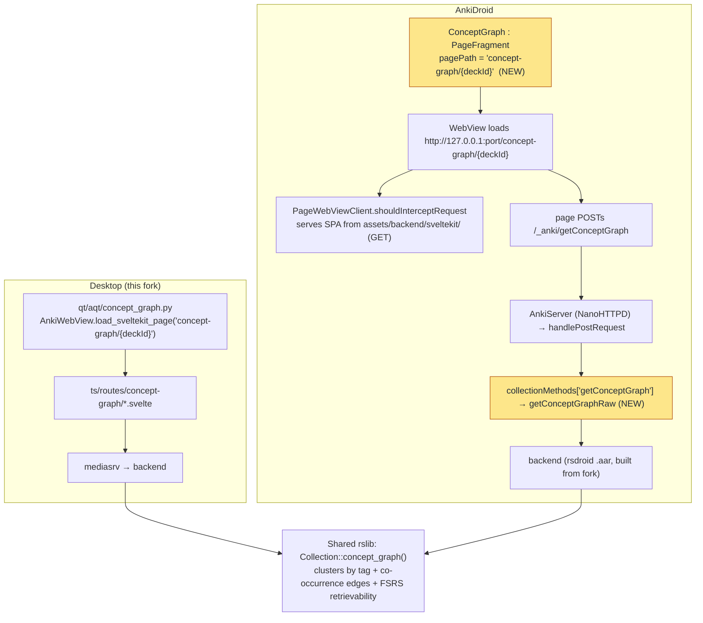

# Porting the Concept Map & Card Edges to AnkiDroid

How to take the **concept map** (knowledge-map view) and **card edges** you built in the
desktop fork and make them work in the **AnkiDroid** app. Grounded in the actual code in
this fork and in `/Users/william/Anki-Android` + `/Users/william/Anki-Android-Backend`.

> **Repos referenced**
>
> - **Fork** (desktop engine + web UI): `/Users/william/anki-speedrun` — already contains the feature.
> - **AnkiDroid** (Kotlin app): `/Users/william/Anki-Android`.
> - **Backend bridge** (rsdroid): `/Users/william/Anki-Android-Backend`.

---

## 1. Mental model (read this first)

The engine and the web UI travel to Android by **two different roads**:

- **Rust engine + web page assets** ride inside the **rsdroid `.aar`**. When you rebuild the
  `.aar` from your fork, it carries (a) the compiled `concept_graph`/`topic_mastery` Rust code,
  (b) the **regenerated Kotlin protobuf stubs** for the new RPCs, and (c) the **built SvelteKit
  app** (a single-page bundle that already includes the `concept-graph` route). None of that
  needs hand-porting.
- **The wiring that exposes a page** does **not** come for free. AnkiDroid hosts shared
  SvelteKit pages through its own `com.ichi2.anki.pages` package, guarded by **two hardcoded
  allowlists** and a small Kotlin entry point. Those are the edits you must make.

So porting ≈ **rebuild the forked `.aar`** + **~5 small AnkiDroid edits**. That's it.

### Card edges are just tags → they're already on the phone

Your edges are **tags**, per the Phase-1/2 design (`cluster::*`, `rung::*`), plus the
**co-occurrence edges** the concept graph derives at query time (two readings on one note).
Tags sync natively (they live on notes), and the co-occurrence edges are computed **on-device**
by the shared engine (`Collection::concept_graph`). **No edge-sync work, no schema, no new
table** — nothing extra to port for edges. The only thing to port is the _view_ that displays
them.

---

## 2. How a shared page works on each platform



**Desktop** (already built): `concept_graph.py` opens an `AnkiWebView` pointed at the SvelteKit
route; the page POSTs `/_anki/getConceptGraph`; `mediasrv` forwards to the backend.

**Android**: a new `ConceptGraph` `PageFragment` loads the same route in a WebView.
`PageWebViewClient` serves the page's HTML/JS from the APK assets (`backend/sveltekit/…`,
GET-only), and the page's backend POSTs go through `AnkiServer` → `handleCollectionPostRequest`
→ a **hardcoded method map** → a libanki `*Raw` wrapper → the backend.

---

## 3. What ships automatically vs. what you must wire

| Piece                                                                   | Reaches Android by                                                                               | Action                        |
| ----------------------------------------------------------------------- | ------------------------------------------------------------------------------------------------ | ----------------------------- |
| Rust `concept_graph` / `topic_mastery` impl                             | compiled into the rsdroid `.aar`                                                                 | ✅ automatic (rebuild `.aar`) |
| Kotlin protobuf stubs (`backend.getConceptGraphRaw`, `topicMasteryRaw`) | rsdroid codegen from your `proto/anki/stats.proto`                                               | ✅ automatic (rebuild `.aar`) |
| **Card edges** (`cluster::*`/`rung::*` + co-occurrence)                 | tags sync natively; edges computed on-device                                                     | ✅ automatic                  |
| SvelteKit `concept-graph` route assets                                  | inside the `.aar` (`assets/backend/sveltekit/`, one SPA bundle for all routes)                   | ✅ automatic (rebuild `.aar`) |
| Contrast **toggle** (deck-config field + `DisplayOrder.svelte`)         | ships in the `.aar` + the existing, already-allowlisted `deck-options` page + synced deck config | ✅ automatic                  |
| Page **route allowlist** (`isSvelteKitPage`)                            | —                                                                                                | ✳️ **manual edit**             |
| Backend **method dispatch** (`collectionMethods` + `*Raw`)              | —                                                                                                | ✳️ **manual edit**             |
| Kotlin `ConceptGraph` fragment + entry point                            | —                                                                                                | ✳️ **new code**                |

---

## 4. Prerequisite

The forked-engine build must work first (see `PHASE1_PLAN.md` → _Engine baseline & mobile_ and
the setup notes): rsdroid `.aar` built from your fork @ anki `25.09.2`, with `local_backend=true`
in `Anki-Android/local.properties`. Everything below assumes that `.aar` is being rebuilt from
your fork (so it carries the new Rust code, proto stubs, and the SvelteKit bundle).

---

## 5. Step-by-step

### Step 1 — Rebuild the forked `.aar`

From `/Users/william/Anki-Android-Backend` (submodule pointed at your fork), rebuild:

```bash
./gradlew :rsdroid:assembleRelease
```

This regenerates the Kotlin stubs from your `stats.proto` (so `backend.getConceptGraphRaw` /
`backend.topicMasteryRaw` exist) and bundles the SvelteKit assets (including `concept-graph`).

### Step 2 — Allowlist the route (`PageWebViewClient.kt`)

Without this, the WebView won't serve `index.html` for the route and you get a blank page.
`AnkiDroid/src/main/java/com/ichi2/anki/pages/PageWebViewClient.kt`:

```kotlin
fun isSvelteKitPage(path: String): Boolean {
    val pageName = path.substringBefore("/")
    return when (pageName) {
        "graphs",
        "congrats",
        "card-info",
        "change-notetype",
        "deck-options",
        "import-anki-package",
        "import-csv",
        "import-page",
        "image-occlusion",
        "concept-graph", // <-- ADD
        -> true
        else -> false
    }
}
```

### Step 3 — Add libanki `*Raw` wrappers (`BackendStats.kt`)

`libanki/src/main/java/com/ichi2/anki/libanki/stats/BackendStats.kt` — mirror `graphsRaw`:

```kotlin
fun Collection.getConceptGraphRaw(input: ByteArray): ByteArray = backend.getConceptGraphRaw(input)
fun Collection.topicMasteryRaw(input: ByteArray): ByteArray = backend.topicMasteryRaw(input)
```

(`backend.getConceptGraphRaw` / `topicMasteryRaw` are the codegen'd stubs from Step 1.)

### Step 4 — Register the backend methods (`PostRequestHandler.kt`)

`AnkiDroid/src/main/java/com/ichi2/anki/pages/PostRequestHandler.kt` — add imports + map entries.
The map key must match the method the TS client POSTs (RPC name, lower-camelCase):

```kotlin
import com.ichi2.anki.libanki.stats.getConceptGraphRaw
import com.ichi2.anki.libanki.stats.topicMasteryRaw

val collectionMethods =
    hashMapOf<String, CollectionBackendInterface>(
        // …existing entries…
        "getConceptGraph" to { bytes -> getConceptGraphRaw(bytes) },
        "topicMastery" to { bytes -> topicMasteryRaw(bytes) },
    )
```

Miss this and logcat shows `unhandled method: getConceptGraph`.

### Step 5 — Add the `ConceptGraph` page fragment (mirror `DeckOptions`)

New file `AnkiDroid/src/main/java/com/ichi2/anki/pages/ConceptGraph.kt` (deck-scoped, like
`DeckOptions` which uses `deck-options/$deckId`):

```kotlin
package com.ichi2.anki.pages

import android.content.Context
import android.content.Intent
import android.os.Bundle
import android.view.View
import com.google.android.material.appbar.MaterialToolbar
import com.ichi2.anki.CollectionManager.withCol
import com.ichi2.anki.R
import com.ichi2.anki.SingleFragmentActivity
import com.ichi2.anki.launchCatchingTask
import com.ichi2.anki.libanki.DeckId

/** Read-only knowledge map for a deck. Hosts the shared `concept-graph` SvelteKit page. */
class ConceptGraph : PageFragment() {
    override val pagePath: String by lazy {
        "concept-graph/${requireArguments().getLong(KEY_DECK_ID)}"
    }

    override fun onViewCreated(view: View, savedInstanceState: Bundle?) {
        super.onViewCreated(view, savedInstanceState)
        val deckId = requireArguments().getLong(KEY_DECK_ID)
        launchCatchingTask {
            val name = withCol { decks.name(deckId, default = true) }
            view.findViewById<MaterialToolbar>(R.id.toolbar)?.title = name
        }
    }

    companion object {
        private const val KEY_DECK_ID = "deckId"

        fun getIntent(context: Context, deckId: DeckId): Intent =
            SingleFragmentActivity.getIntent(
                context,
                fragmentClass = ConceptGraph::class,
                arguments = Bundle().apply { putLong(KEY_DECK_ID, deckId) },
            )
    }
}
```

(The base `PageFragment` default layout `R.layout.fragment_page` already provides the toolbar +
WebView + loading spinner, so no new layout is required for a first pass.)

### Step 6 — Add an entry point

Give users a way in — mirror how **Deck options** is launched from the DeckPicker's per-deck
menu. In the deck long-press / overflow menu handler in `DeckPicker` (menu XML under
`AnkiDroid/src/main/res/menu/` + its handler in `DeckPicker.kt`), add a "Concept map" item that
starts the activity:

```kotlin
startActivity(ConceptGraph.getIntent(this, deckId))
```

(On desktop the equivalent entry lives in `qt/aqt/deckbrowser.py`, which opens
`show_concept_graph(mw, deck_id)`.)

### Step 7 — Rebuild + install AnkiDroid

```bash
cd /Users/william/Anki-Android
./gradlew installPlayDebug     # with local_backend=true so it uses your .aar
adb shell monkey -p com.ichi2.anki.debug -c android.intent.category.LAUNCHER 1
```

### Step 8 — Verify on the emulator

- Open a deck's menu → **Concept map** → the graph renders (nodes = readings/clusters, edges =
  co-occurrence).
- `adb logcat | grep -i _anki` should show a successful `POST /_anki/getConceptGraph` (no
  "unhandled method").
- Toggle `contrast_scheduling` in **Deck options** on the phone (already works via the shared
  page + synced deck config) and confirm queue order changes.

---

## 6. Gotchas (most-likely failure points, in order)

1. **`isSvelteKitPage` allowlist** (Step 2) — the single easiest thing to forget → blank white page.
2. **`collectionMethods` entry** (Step 4) — missing → `unhandled method: getConceptGraph` in logcat, page loads but shows no data.
3. **`.aar` not rebuilt from your fork** — then the SvelteKit bundle lacks the `concept-graph`
   route and/or the stubs lack `getConceptGraphRaw` → 404 asset or missing Kotlin symbol. The
   `backend/sveltekit/` assets and the proto stubs both come _from the `.aar`_, so a stale/stock
   `.aar` breaks both.
4. **Proto/rslib version parity** — build both desktop and the `.aar` from the same `25.09.2`
   commit so the generated stub signatures match (see the engine-baseline decision).
5. **`AnkiServer` rejects GET** — this is by design; page assets are served by
   `PageWebViewClient.shouldInterceptRequest` from APK assets, _not_ by the local server. Don't
   try to "fix" the server to serve HTML.
6. **Method-name casing** — the TS client POSTs the RPC name in lower-camelCase
   (`getConceptGraph`), which must exactly match the `collectionMethods` key.
7. **Night mode / back handling** — `PageFragment` handles the basics; copy `DeckOptions`'
   back-press handling only if you later add modals.

---

## 7. File reference

| Concern                                    | Desktop (fork)                                               | AnkiDroid / backend                                                                     |
| ------------------------------------------ | ------------------------------------------------------------ | --------------------------------------------------------------------------------------- |
| Engine (clusters + edges + retrievability) | `rslib/src/stats/concept_graph.rs`                           | ships in rsdroid `.aar`                                                                 |
| Mastery RPC                                | `rslib/src/stats/mastery.rs`                                 | ships in rsdroid `.aar`                                                                 |
| Proto (RPCs + messages)                    | `proto/anki/stats.proto` (`GetConceptGraph`, `TopicMastery`) | codegen'd Kotlin stubs in `.aar`                                                        |
| Web page                                   | `ts/routes/concept-graph/*.svelte`                           | served from `.aar` `assets/backend/sveltekit/`                                          |
| Open the page                              | `qt/aqt/concept_graph.py`, `qt/aqt/deckbrowser.py`           | **new** `pages/ConceptGraph.kt` + DeckPicker menu                                       |
| Route allowlist                            | n/a (mediasrv serves all)                                    | `pages/PageWebViewClient.kt` `isSvelteKitPage()`                                        |
| Backend dispatch                           | n/a (mediasrv generic)                                       | `pages/PostRequestHandler.kt` `collectionMethods` + `libanki/.../stats/BackendStats.kt` |
| Edges data                                 | tags on notes (`cluster::*`/`rung::*`) + co-occurrence       | tags sync natively; edges computed on-device                                            |

---

## 8. Verification checklist

- [ ] rsdroid `.aar` rebuilt from fork @ `25.09.2`; `local_backend=true` set
- [ ] `backend.getConceptGraphRaw` / `topicMasteryRaw` exist in the generated stubs
- [ ] `"concept-graph"` added to `isSvelteKitPage()`
- [ ] `getConceptGraphRaw` + `topicMasteryRaw` added to `BackendStats.kt`
- [ ] `"getConceptGraph"` + `"topicMastery"` added to `collectionMethods` (with imports)
- [ ] `ConceptGraph.kt` fragment + `getIntent` added
- [ ] entry point wired into the DeckPicker deck menu
- [ ] `installPlayDebug` succeeds; page renders on the emulator
- [ ] logcat shows a successful `POST /_anki/getConceptGraph` (no "unhandled method")
