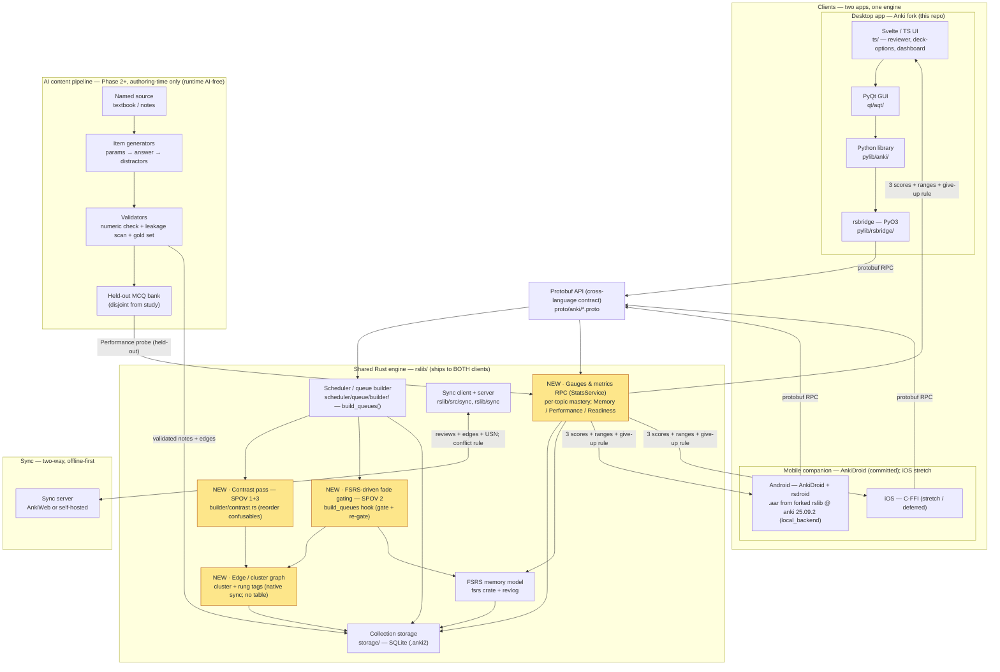
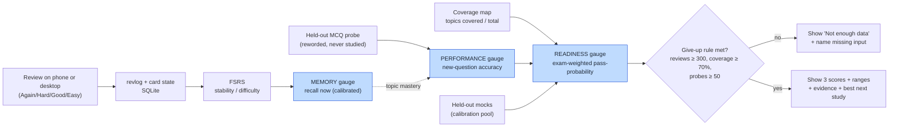

# Product Requirements Document — Anki Speedrun

**Bridging Memory → Performance in Anki (CFA Level I)**

> Companion to `brainlift.md` (the thesis & evidence), the three engineering
> plans (`PHASE1_PLAN.md`, `PHASE2_PLAN.md`, `PHASE3_PLAN.md`), and the project
> brief (_Speedrun: A Desktop + Mobile Study App Built on Anki_).
> This document is the umbrella PRD: it states **who** the product is for, **what**
> it must do, **why** (the learning science), and **when** (the three deadlines).

|                            |                                                                                                                                                                                                                           |
| -------------------------- | ------------------------------------------------------------------------------------------------------------------------------------------------------------------------------------------------------------------------- |
| **Product**                | A fork of Anki + a phone companion that turn a spaced-repetition app into a **transfer-and-readiness** engine for one exam.                                                                                               |
| **Exam (stated up front)** | **CFA Level I** — pass/fail; 180 standalone A/B/C MCQs; 10 weighted topic areas → readings → Learning Outcome Statements (LOS); fact-, formula-, and ethics-heavy.                                                        |
| **Thesis**                 | Plain flashcards build _memory_; the **schedule and selection** of cards — not just their spacing — can be engineered to build _performance_ (transfer to new exam-style questions) and to estimate _readiness_ honestly. |
| **License**                | AGPL-3.0-or-later, with credit to Anki (some Anki components are BSD-3-Clause).                                                                                                                                           |
| **One engine**             | All scheduling logic lives in Anki's **Rust core (`rslib/`)**, so the same engine ships to **desktop and phone**.                                                                                                         |
| **Engine baseline**        | Pinned to anki **`25.09.2`** (the tag AnkiDroid's backend `0.1.64` targets) so one commit builds **desktop + phone**; the fork's `26.05` line is set aside for the engine.                                                |
| **Mobile**                 | **Android via AnkiDroid + `anki-android-backend` (rsdroid)**, rebuilt against our fork with `local_backend=true`. iOS (C-FFI) is stretch/deferred.                                                                        |
| **Status**                 | Planning / pre-implementation. Feature names below appear only in planning docs today; this PRD describes the work to be built on real codebase seams.                                                                    |

> **Scope note — current iteration (ablation descoped).** For the study-feature
> **ablation**, the _only_ current deliverable is that each new feature ships
> behind an **on/off toggle** (ablation-_ready_). **Implementing the ablation
> itself — simulations, held-out scoring, calibration runs, and statistical
> analysis — is deferred** and out of scope right now. Passages describing that
> measurement / "prove-it" work are kept below as the _eventual_ plan and tagged
> **[Deferred]**. Honest trade-off: per the brief, deferring held-out testing
> caps the grade at ~60%, and the study-feature (15%) / score-accuracy (20%)
> areas can't be fully earned until the deferred work lands — a deliberate,
> temporary sequencing choice.

---

## Table of contents

1. [Problem & background](#1-problem--background)
2. [Goals & non-goals](#2-goals--non-goals)
3. [User personas](#3-user-personas)
4. [The three-gauge model (Memory / Performance / Readiness)](#4-the-three-gauge-model)
5. [Features (from the brainlift SPOVs)](#5-features-from-the-brainlift-spovs)
6. [Hard requirements ("rules you cannot break")](#6-hard-requirements)
7. [Architecture](#7-architecture)
8. [Phased delivery plan (Wednesday / Friday / Sunday)](#8-phased-delivery-plan)
9. [Cross-cutting requirements (performance, reliability, AI safety)](#9-cross-cutting-requirements)
10. [Test & evaluation plan (the concrete challenges)](#10-test--evaluation-plan)
11. [Success metrics & grading alignment](#11-success-metrics--grading-alignment)
12. [Risks, assumptions & open questions](#12-risks-assumptions--open-questions)
13. [References](#13-references)

---

## 1. Problem & background

A big exam asks for more than memory. A CFA Level I candidate must **use** a fact
on a new, application-style MCQ they have never seen, **discriminate** among
confusable categories (FIFO/LIFO/weighted-average; Macaulay/modified/effective
duration; forwards/futures/swaps; the Ethics Standards), **work fast enough** to
finish, and **judge whether they are actually ready** — and they study in two
places: at a desk and on a phone between commitments.

**What baseline Anki already does well (and we do _not_ re-build):** Anki is
already _retrieval practice_ (flashcards) plus an _optimized spacing engine_
(FSRS). It assigns each card a memory state (stability, difficulty) toward a
desired retention, mixes new/review cards, and grades Again/Hard/Good/Easy. Its
queues are ordered by **card state and due date, never by content**, every card
is scheduled **independently**, and **sibling-burying is the only inter-card
relationship**.

**The gap this product targets.** Remembering "the powerhouse of the cell" does
not mean answering a passage about cellular respiration; remembering a flashcard
does not mean answering a reworded CFA item. FSRS estimates **memory** well. The
two harder bridges are **memory → performance** (answering new questions) and
**performance → readiness** (a real, honest score-with-uncertainty). This product
builds and _measures_ those two bridges — and refuses to fake the number.

The full evidence base (testing effect, transfer-of-testing moderators,
worked-example effect, expertise reversal, interleaving for discrimination,
successive relearning, the boundary conditions, and the experts behind each) is
documented in **`brainlift.md`** and is the scientific backbone for every feature
below.

---

## 2. Goals & non-goals

### Goals

- **G1 — Engineer transfer at the engine level.** Make a real change inside
  Anki's **Rust** scheduler so that _which_ cards are shown, _together_, and _in
  what form_ is driven by content relationships and FSRS state — not just due date.
- **G2 — Measure three things separately and honestly.** Show **Memory**,
  **Performance**, and **Readiness** as three distinct numbers, each with a range
  and a give-up rule. Never blend them into one flattering figure.
- **G3 — Two apps, one engine.** A desktop app (primary) and a phone companion
  that **share the same Rust engine, the same deck, and the same progress**, and
  **sync** two-way, offline-first.
- **G4 — Make every feature ablation-_ready_ (toggle now; prove-it later).** Each
  new study feature ships behind an **on/off toggle** so it _can_ later be compared
  ON/OFF/vanilla. **[Deferred]** actually running the ablation (equal study time,
  scored on held-out data, reporting what didn't work) is out of current scope.
- **G5 — Safe, sourced AI (Friday+).** Every AI output traces to a named source,
  is validated against a gold set before a student sees it, and **beats a simpler
  baseline**. The apps still produce a score with **AI switched off**.
- **G6 — Ship.** Installable desktop builds and a phone build that both run on a
  clean device with AI off.

### Non-goals

- Re-implementing retrieval practice or spacing (already owned by Anki/FSRS).
- UI-only "study tricks" that cannot be cleanly ablated at the engine.
- Other exams or **CFA Levels II–III** (vignette/essay formats); multi-subject
  breadth. Scope is deliberately **CFA Level I**.
- Debunked ideas (e.g., learning styles).
- Inventing a precise numeric readiness score with nothing behind it
  (**automatic fail** per the brief).

---

## 3. User personas

### Primary — **Priya, the working CFA Level I candidate**

|                                     |                                                                                                                                                                                                                                                        |
| ----------------------------------- | ------------------------------------------------------------------------------------------------------------------------------------------------------------------------------------------------------------------------------------------------------ |
| **Age / role**                      | 26, junior analyst / recent finance grad, studying ~300 hours over ~5 months **while working full-time**.                                                                                                                                              |
| **Context of use**                  | Desk sessions on evenings/weekends (desktop); short bursts on her **phone** during the commute and between meetings. She needs both, synced.                                                                                                           |
| **Goals**                           | Pass CFA L1 on the first attempt; spend scarce study time on the **highest-value** cards; **know when she is genuinely ready**.                                                                                                                        |
| **Frustrations**                    | She can recite flashcards but **freezes on application MCQs**; she **confuses** look-alike concepts (FIFO/LIFO, the duration trio, Ethics Standards); she **distrusts** generic "78% ready" numbers; she is anxious about readiness and time pressure. |
| **What she needs from the product** | Scheduling that builds **transfer** (contrast on confusables, faded worked examples for formula topics), **honest three-gauge** feedback with ranges and a give-up rule, **cross-device sync**, and **offline** review.                                |
| **Tech comfort**                    | Comfortable using Anki; **not** a developer. Wants sensible defaults and a clear dashboard, not knobs.                                                                                                                                                 |
| **Definition of success for her**   | "When the app says I'm likely to pass, I trust it — and I actually pass."                                                                                                                                                                              |

### Secondary — **Marcus, the power user / Anki tinkerer (BYO deck)**

|                    |                                                                                                                                                                               |
| ------------------ | ----------------------------------------------------------------------------------------------------------------------------------------------------------------------------- |
| **Role**           | Self-directed candidate who already runs Anki heavily, edits deck options, and **brings his own deck** (possibly untagged). Values open-source/AGPL and engine-level control. |
| **Goals**          | Turn features on/off per deck; apply contrast/fade to a deck the team didn't curate.                                                                                          |
| **Needs**          | Per-deck toggles (`contrast_scheduling`, `fade_*`), and a path for **untagged decks** (Phase 3 edge sourcing). Stable undo and no collection corruption.                      |
| **Why he matters** | He stresses the **generalization** requirement and the deck-config UX; he is the proof the feature isn't hard-wired to one curated deck.                                      |

### Stakeholder — **The evaluator / learning-science reviewer**

Not an end-user of the study loop, but the audience for the **honesty rule**, the
**ablation**, calibration charts, held-out hygiene, and reproducibility. Every
"prove it" requirement (Section 10) exists to satisfy this stakeholder: a fair
test that _could_ show the idea fails scores better than a polished claim that
can't be backed up.

---

## 4. The three-gauge model

Mixing these three together is the easiest way to fail. They answer **different
questions** and must be shown **separately**, each with a range.

| Gauge           | Question it answers                                                   | How it's produced                                                                                                                                                                                                                                                 | CFA L1 specifics                                                                                        |
| --------------- | --------------------------------------------------------------------- | ----------------------------------------------------------------------------------------------------------------------------------------------------------------------------------------------------------------------------------------------------------------- | ------------------------------------------------------------------------------------------------------- |
| **Memory**      | Can the student recall this fact **right now**?                       | Anki's **FSRS** per-card stability/retrievability, aggregated; validated by calibration on held-out reviews.                                                                                                                                                      | Already strong in baseline Anki.                                                                        |
| **Performance** | Can the student answer a **new, exam-style** MCQ that uses this fact? | A model over topic mastery, item difficulty, timing, and coverage, scored on a **disjoint held-out MCQ bank**.                                                                                                                                                    | A/B/C application items with misconception distractors.                                                 |
| **Readiness**   | What's the **probability of passing today**, and how sure are we?     | **Documented method** (`Σ topic_weight × performance` → logistic P(pass) at the assumed MPS band) that **abstains** until held-out-mock calibration exists; until then shows decomposed components (mastery, coverage, expected-accuracy band) + best-next-topic. | CFA L1 is **pass/fail** → a **pass-probability**, _not_ an invented number; calibration **[Deferred]**. |

### The honesty rule (required)

The app **may not** show a Readiness number unless it can also show: the
**evidence** behind it, **what data is missing**, **how accurate past guesses
were** (calibration), the **likely range** (not a single number), and **the single
best next thing to study**. _A confident number with none of that behind it is a
guess in a nice font._

### The give-up rule (ours, written down)

> **Readiness is shown only when all hold:** (1) ≥ **300 graded reviews**
> logged, **(2)** ≥ **70%** of the 10 CFA topic areas have at least one studied
> LOS (**coverage**), and **(3)** ≥ **50 held-out Performance-probe items**
> answered. If any threshold is unmet, the dashboard shows **"Not enough data"**
> and **names the missing input** (e.g., "no Derivatives coverage yet"). Memory
> and Performance aggregates likewise **abstain** when their inputs are too sparse.

A good system knows when it doesn't know.

---

## 5. Features (from the brainlift SPOVs)

The three "Spiky Points of View" from `brainlift.md` are the product's
differentiating features. Each is an **engine-level, cleanly-ablatable** lever,
not a UI trick.

### F1 — Schedule the graph, not the card (SPOV 1) — _the spine_

- **What:** Make the schedulable unit a **linked cluster** of cards, not a lone
  card. Cards carry **edges** (interference edges = confusable; dependency edges =
  fact → application / rung → rung). The scheduler works around **topics**, and
  can deliberately schedule similar-or-different cards based on user state.
- **Why:** Anki's independence is the ceiling on transfer; Pan & Rickard's
  transfer moderators (format-match, elaboration, initial success) are an **engine
  spec**, not study tips.
- **How (engine):** A post-gather pass in `Collection::build_queues`
  (`rslib/src/scheduler/queue/builder/`) operates over the edge graph, which is encoded
  **entirely in tags** — `cluster::*` (interference) + `rung::*` (dependency). This rides
  Anki's **native tag sync**; a first-class synced `card_relationships` table is avoided
  (sync-protocol cost) and added later **only if needed**.

### F2 — Surface confusable siblings; don't bury them (SPOV 3)

- **What:** Place confusable cards **back-to-back** (FIFO/LIFO; the duration trio;
  neighbouring Ethics Standards) so the **interference becomes the lesson**.
- **Why:** Interleaving is a **discrimination trainer** — modest in general but
  strong for _problem-type_ discrimination (Rohrer d=0.42→0.79 at a month), the
  exact CFA case. Anki's sibling-burying buys Memory at Performance's expense.
- **How (engine):** **Contrast scheduling** — reorder within the gathered new/
  review piles so same-cluster cards are adjacent; **no gating, pure reordering**
  in Phase 1 (cheap and safe). Per-deck toggle `contrast_scheduling`.
- **This is the Wednesday Rust change.**

### F3 — Fade the scaffold, driven by FSRS state (SPOV 2)

- **What:** A **worked → faded → solve** ladder. Novices see the worked solution;
  as competence grows, guidance fades to a cloze, then to a **format-matched A/B/C
  MCQ**. The spiky part: the **fade level is read off FSRS stability/difficulty**,
  not a fixed schedule or a separate counter.
- **Why:** Worked-example effect + **expertise reversal** + transfer-appropriate
  processing → guidance must fade per-user, and on an **expanding** (spacing-like)
  schedule.
- **How (engine):** **Gating** in `build_queues` — hold rung _k+1_ behind rung _k_'s FSRS
  stability threshold (rungs encoded as `rung::*` tags), **re-gate on answer**, and ensure
  gated-out cards don't wrongly decrement deck limits. Toggles `fade_enabled` / `fade_signal`.
- **Solve rung (content):** worked = plain card; faded = **cloze**; solve = a **custom A/B/C
  MCQ note type** with a self-contained HTML/JS template, **self-graded** (renders on desktop +
  the AnkiDroid webview — no engine change).

### Supporting features (required by the brief)

| Feature                                                      | Summary                                                                                                                                                                                                                                                                                                                                                                                                                          |
| ------------------------------------------------------------ | -------------------------------------------------------------------------------------------------------------------------------------------------------------------------------------------------------------------------------------------------------------------------------------------------------------------------------------------------------------------------------------------------------------------------------- |
| **F4 — Three honest gauges + dashboard**                     | Memory, Performance, Readiness, each with a range, "how sure," last-updated, top reasons, % coverage, and the give-up rule. Shown on **both** apps.                                                                                                                                                                                                                                                                              |
| **F5 — Two-way, offline-first sync**                         | Reviews, progress, **tags (incl. `cluster::*`/`rung::*` edges)**, and deck config flow between phone and desktop with no loss/double-count; a documented conflict rule (Anki USN/mtime).                                                                                                                                                                                                                                         |
| **F6 — Coverage map**                                        | Every CFA topic on the official outline, marked covered/not; % coverage on the dashboard; **abstain** below the line.                                                                                                                                                                                                                                                                                                            |
| **F7 — AI: generation + retrieval-for-grounding (Phase 2+)** | **All AI is authoring-time (offline); runtime is AI-free by construction.** **Generation** (item generators + misconception distractors, **numerically validated** + a **gold-set checker** with a pre-set cutoff) is paired with **retrieval-for-grounding** that attaches each card's **named source** and **beats BM25/vector** (precision@k) — satisfying both halves of R6. Leakage scan; **AI-off works by construction**. |
| **F8 — Feature toggles (ablation-ready)**                    | Every new feature ships behind an on/off toggle so ON/OFF/vanilla _can_ be compared. **[Deferred]** building/running the comparison harness (equal study time, held-out scoring) is out of current scope.                                                                                                                                                                                                                        |
| **F9 — Readiness-optimization allocation (Phase 3)**         | Select cards by `exam-weight × marginal Δ pass-probability` instead of uniform retention; ships behind a toggle. **[Deferred]** the ablation of it.                                                                                                                                                                                                                                                                              |

---

## 6. Hard requirements

Distilled from the brief's "rules you cannot break." All are required; violating a
starred one is an **automatic fail / hard cap**.

- **R1** — A **real change inside Anki's Rust code**, not just the Python screens. _(No real Rust change → 50% cap.)_
- **R2** — **Two apps, one engine**: desktop + phone companion that share cards/progress and **sync**. _(No engine-sharing phone with sync → 70% cap.)_
- **R3** — **Three separate scores** (Memory, Performance, Readiness), each with a **range**.
- **R4 [Deferred]** — **Held-out testing** with a **re-runnable** setup. _Deferred this iteration; per the brief this caps the grade at ~60% until delivered._
- **R5** — One **study feature** with a written hypothesis, shipped behind an **on/off toggle** (so it can be turned off and on). _(Current deliverable = the toggle; **[Deferred]** running the ablation experiment — see the scope note.)_
- **R6** — Every **AI output** is **source-traceable**, validated on a test set, and **beats a simpler method**. _(AI claims with no traceable source → AI section = 0.)_
- **R7** — The app **refuses to score** when it lacks data (give-up rule).
- **R8** — A **desktop installer** and a **phone build** that both run on a clean device **with AI off**. _(Either app fails on a clean device → 50% cap.)_
- **R9** — **License**: AGPL-3.0-or-later with credit to Anki.
- **R10★** — **No made-up / misleading readiness numbers.** _(Automatic fail.)_
- **R11★** — **No leaked test data** into training. _(That score = 0.)_
- **R12** — **No AI before Friday**: the Wednesday build has **no model calls, no generated cards, no chatbot**.

---

## 7. Architecture

Anki is multi-layered: a **Svelte/TypeScript** web UI (`ts/`), a **PyQt** GUI
(`qt/aqt/`) that embeds it, a **Python** library (`pylib/anki/`) that proxies into
the **Rust core (`rslib/`)** via the **`rsbridge`** PyO3 module, with **protobuf**
(`proto/anki/`) as the cross-language contract. Because all scheduling logic lives
in `rslib`, **the same engine ships to both desktop and phone**. The committed path: the
phone is **AnkiDroid** consuming **`anki-android-backend` (rsdroid)**, whose `anki`
submodule is repointed at our fork and rebuilt into a `.aar` (`local_backend=true`); iOS
via C-FFI is a stretch. To keep desktop and phone on the _same_ engine, the baseline is
**pinned to anki `25.09.2`** (the tag rsdroid `0.1.64` targets), so one commit — and one
proto — builds both. New components (highlighted) are added at the engine seam so they
reach **both** clients at once.

### 7.1 System architecture (Mermaid)

### 7.2 Core data flow — the Memory → Performance → Readiness bridge

### 7.3 Key engine touch points (verified against the codebase)

| Concern                           | File / symbol                                                                                                                               |
| --------------------------------- | ------------------------------------------------------------------------------------------------------------------------------------------- |
| Queue build entry (the seam)      | `Collection::build_queues` → `rslib/src/scheduler/queue/builder/mod.rs` (hook between `gather_cards()` and `build()`)                       |
| Gathered piles to reorder/gate    | `QueueBuilder.new` / `.review` → `builder/gathering.rs`                                                                                     |
| New contrast pass (SPOV 1+3)      | `rslib/src/scheduler/queue/builder/contrast.rs` _(new)_                                                                                     |
| FSRS state at queue time (SPOV 2) | `extract_fsrs_variable(data, 's')` → `rslib/src/storage/sqlite.rs`                                                                          |
| Re-gate on answer                 | `update_queues_after_answering_card` / `clear_study_queues` → `scheduler/queue/mod.rs`                                                      |
| Edges (over tags)                 | `cluster::*` + `rung::*` on `notes.tags` (sync natively; no schema change) → `rslib/src/tags/`                                              |
| Per-deck toggles                  | `proto/anki/deck_config.proto`, `rslib/src/deckconfig/mod.rs`, read in `QueueBuilder::new`                                                  |
| Deck-options UI                   | `ts/routes/deck-options/`                                                                                                                   |
| Gauges / metrics RPC              | per-topic mastery RPC extending `StatsService` — `proto/anki/stats.proto`, new fn in `rslib/src/stats/` (mirror `graphs/retrievability.rs`) |
| Sync (engine-shared)              | `rslib/src/sync/`, `rslib/sync`                                                                                                             |
| Python bridge                     | `pylib/rsbridge/lib.rs` (PyO3)                                                                                                              |
| Mobile build                      | `Anki-Android` + `Anki-Android-Backend` (rsdroid); `anki` submodule → our fork @ `25.09.2`; `local_backend=true`                            |
| Engine baseline                   | anki tag `25.09.2` (matches rsdroid `0.1.64-anki25.09.2`)                                                                                   |

---

## 8. Phased delivery plan

Build in order — **make the apps work, add AI, then prove it**. Each deadline
needs **proof, not a promise**. The detailed engineering milestones live in the
phase plans; this section maps them to the brief's deadlines and folds in the
deadline-specific deliverables.

> **Mapping:** `PHASE1_PLAN.md` → **Wednesday**, `PHASE2_PLAN.md` → **Friday**,
> `PHASE3_PLAN.md` → **Sunday**.

### Phase 1 — Wednesday: "Both apps work and review the same deck. **No AI.**"

**Detailed plan:** [`PHASE1_PLAN.md`](./PHASE1_PLAN.md) — _Contrast Scheduling (SPOV 1 platform + SPOV 3)_.

- **Brainlift features:** **F1 (SPOV 1)** tag-derived edge/cluster platform +
  **F2 (SPOV 3)** contrast scheduling — _pure reordering_, no gating, no schema
  change, no new content.
- **The Rust change (R1) — two artifacts:** (1) `contrast_scheduling` deck-config toggle
  (new protobuf field, **called from Python**) + a contrast pass in `build_queues` that
  clusters by tag and surfaces confusables adjacently; (2) a **per-topic mastery/metrics
  RPC** extending `StatsService`, fast on 50k. Both ship to **both** apps via `rslib`.
- **Tag taxonomy:** one two-level scheme on `453127574` — `cfa::topic::*` (10 CFA areas;
  drives mastery/coverage/readiness) + curated `cluster::*` confusable families (drives
  contrast). Verify in Browse before coding.
- **Gauges:** **Memory** gauge live (backed by the mastery RPC) with an honest range + the
  give-up rule.
- **Apps:** Desktop forked & **building from source** (@ anki `25.09.2`); a **review loop on
  the CFA deck**. Phone = **AnkiDroid + rsdroid rebuilt on our fork** (`local_backend`),
  loads the deck, and runs a **real review session on the shared engine** (two-way sync
  _not_ yet required).
- **Ablation toggle (current):** `contrast_scheduling` **ON/OFF** per deck (OFF =
  vanilla) — the on/off feature _is_ the deliverable. **[Deferred]** running the
  2-arm comparison + the held-out discrimination quiz.
- **Ship:** A **desktop installer that runs on a clean machine**.
- **Proof:** commit hash + clean-build recording; **≥ 3 Rust unit tests + 1
  Python test**; undo-works / no-corruption check; clean-machine install recording;
  phone review-session screen recording.
- **Exit criteria:** toggling `contrast_scheduling` visibly changes queue order;
  all tests green; both apps review the same deck.

### Phase 2 — Friday: "**AI is added and checked.** Phone syncs with desktop and shows readiness."

**Detailed plan:** [`PHASE2_PLAN.md`](./PHASE2_PLAN.md) — _The Performance Layer (SPOV 2): worked → faded → solve_.

- **Brainlift features:** **F3 (SPOV 2)** worked → faded → solve, **fade read off
  FSRS state**; the **dependency-edge** half of **F1**; **problem content**
  (parameterized generators) and the **A/B/C MCQ solve rung**.
- **AI (now permitted, R6):** LLM-**accelerated** authoring of generators +
  misconception distractors; **every item numerically/automatically validated**;
  **strict train/test split**; each output **traces to a named source**; an **eval
  runs before students see anything** (accuracy + wrong-answer rate on a held-out
  set, with a pre-set cutoff); a **side-by-side beating keyword/vector search**.
  **AI-off still yields a score.**
- **Engine:** **Gating** in `build_queues` (hold rung behind prerequisite FSRS
  stability; **re-gate on answer**; correct limit bookkeeping). `fade_enabled` /
  `fade_signal` toggles. Dependencies are **`rung::*` tags** within clusters — **no
  `card_relationships` table, no schema change** (rides native sync).
- **Gauges:** the worked→faded→solve content + the **Performance method/components** are
  built; **held-out-bank Performance scoring is [Deferred]**. Phone shows the three gauges
  with ranges and follows the give-up rule (Readiness abstains).
- **Sync (R2):** **two-way** desktop↔phone — review on phone, see it on desktop and
  vice-versa, **no lost/double-counted** reviews; **offline review then sync**.
- **Ablation toggle (current):** `fade_enabled` **ON/OFF** (and `fade_signal`) —
  the on/off feature _is_ the deliverable. **[Deferred]** running the 3-arm
  comparison on a disjoint held-out bank.
- **Proof:** AI **gold-set** numbers + the **retrieval-beats-BM25/vector** comparison; a
  recording of a card reviewed on the phone appearing on the desktop after sync.
- **Exit criteria:** AI content passes its cutoff before display; two-way sync is loss-free;
  AI-off path verified. _(Held-out Performance scoring is **[Deferred]**.)_

### Phase 3 — Sunday: "**You prove it works, and ship installable builds for both.**"

**Detailed plan:** [`PHASE3_PLAN.md`](./PHASE3_PLAN.md) — _Readiness, Unification & the Rigorous Ablation_.

- **Brainlift features:** **Unification** — one graph-aware scheduler running **both** edge
  types (interference + dependency) at once **over the tag taxonomy** (no synced edge table);
  the **Readiness** gauge (**F4** complete, _method + abstain_); **F9** readiness-optimization
  allocation (`exam-weight × marginal Δ pass-prob`, the demoted SPOV 4).
- **Models & evidence [Deferred]:** **Memory calibrated** (calibration chart +
  Brier/log-loss on held-out reviews); **Performance** accuracy on held-out
  exam-style questions; **Readiness** mapping written down with a range,
  **calibrated against held-out mocks** (probe vs. calibration pools kept
  **disjoint** to avoid circularity). _Deferred — out of current scope._
- **Rigorous ablation [Deferred]:** **feature ON / OFF / unmodified Anki**, equal
  study time, same content, enough power; per-SPOV contributions and the combined
  effect across **all three gauges**; **report what didn't work**. _Deferred — the
  current deliverable is just the ON/OFF toggles from Phases 1–2._
- **Generalization:** **BYO / untagged-deck** edge sourcing (LLM cluster proposals
  - **behavioral confusion mining** from revlog + similarity _only with a
    confusability signal_), all **validated** before use.
- **Ship (R8):** packaged **desktop installer(s)** + a packaged **phone build**
  (signed APK, or iOS via TestFlight/sideload); **sync conflict handling**
  documented; **both run with AI off** and still give a score.
- **Optional Rust change (qualifies for R1):** a **mastery/metrics query** RPC —
  per topic, cards mastered + average recall — fast enough to power the dashboard
  on **50,000 cards**.
- **Proof / hand-in:** results report; one-page **model descriptions** (Memory /
  Performance / Readiness, each with its give-up rule); the **Brainlift**; the
  **3–5 min demo video**; clean-device install/run recordings for both builds; the
  **public AGPL repo** with exam stated up front, build instructions for both apps,
  the architecture overview, the Rust-change note, and the touched-files list.

### Phase summary

|                       | **Wed — Phase 1 (MVP, no AI)**              | **Fri — Phase 2 (AI)**                | **Sun — Phase 3 (prove & ship)**                       |
| --------------------- | ------------------------------------------- | ------------------------------------- | ------------------------------------------------------ |
| **Brainlift feature** | SPOV 1 platform + SPOV 3 contrast           | SPOV 2 fade ladder + dependency edges | Unify all SPOVs + readiness allocation                 |
| **Gauge added**       | Memory                                      | Performance                           | Readiness (calibrated)                                 |
| **Engine work**       | Contrast reorder pass + mastery/metrics RPC | FSRS-driven gating + re-gate          | Tag-graph unify + readiness method                     |
| **AI**                | **None (forbidden)**                        | Validated, sourced, beats baseline    | Edge sourcing for BYO decks                            |
| **Apps / sync**       | Both review same deck (no 2-way)            | **Two-way** offline-first sync        | Packaged installers; conflict handling                 |
| **Ablation**          | Toggle `contrast_scheduling` ON/OFF         | Toggle `fade_enabled` ON/OFF          | Toggles unified — _running the ablation is [Deferred]_ |

---

## 9. Cross-cutting requirements

### Performance & reliability targets (measured on the shared 50k-card deck; report p50 / p95 / worst)

| Action                           | Target                                              |
| -------------------------------- | --------------------------------------------------- |
| Button press acknowledged        | **p95 < 50 ms** (desktop & phone)                   |
| Next card after grading          | **p95 < 100 ms**                                    |
| Dashboard first load             | **p95 < 1 s**                                       |
| Dashboard refresh (no UI freeze) | **p95 < 500 ms**                                    |
| Sync of a normal session         | **< 5 s** on a normal connection                    |
| Memory on 50k cards              | under a **stated** limit, desktop & mid-range phone |
| Cold start                       | **< 5 s** desktop, **< 4 s** phone                  |
| UI never frozen                  | **> 100 ms** stalls disallowed                      |
| Crash test                       | **zero corrupted collections**, both platforms      |

A **one-command benchmark** (`make bench`-style) loads the 50k deck and prints
p50/p95/worst for each action above (no single hand-picked number).

### AI safety (Phase 2+)

- **Authoring-time only:** all AI runs in an **offline dev pipeline**; the runtime app is
  **AI-free by construction** (pre-generated, validated cards + stored sources baked into the
  deck), so "AI-off" and graceful degradation need **no runtime fallback path**.
- Every AI output **traces to a named source**; **no source → not shown**.
- **Pre-display eval** on a held-out set with a **pre-set cutoff**; blocked items
  never reach the student.
- **Beats a simpler baseline** (keyword or vector search), shown side-by-side.
- **Prompt-injection** resistance (a source file with hidden text must not hijack
  generation).
- **Graceful degradation**: AI offline / rate-limited / malformed only affects the **authoring
  pipeline** (it retries/skips); the **student app never calls AI at review time**, so it keeps
  working and **still gives a score**.

### Compatibility & brownfield discipline

This is a **fork of a mature codebase** synced with the wider Anki ecosystem.
Changes must preserve: **collection DB schema** (only additive, versioned
migrations, never edit shipped ones — note we **avoid a schema bump** by encoding
edges as tags), **sync protocol**
compatibility, **protobuf wire format** (add fields with new numbers; never
renumber/remove), the **public/add-on API** (deprecate via `anki._legacy`, don't
break), **translations** (add to `ftl/core`; deprecate, don't delete), and
sensible **config defaults** (new behavior is opt-in via toggles). New files carry
the **AGPL license header**; new contributors are added to `CONTRIBUTORS`. Keep
diffs minimal and upstream-mergeable; verify with `just check` (and `just
minilints`). See `.cursor/skills/anki-brownfield-development/SKILL.md`.

---

## 10. Test & evaluation plan

The brief's "concrete challenges," mapped to this product. **Scope note:** the
**ablation / measurement** challenges that _prove the feature_ — **7d** and the
held-out scoring / calibration behind the gauges — are **[Deferred]** this
iteration (the on/off toggles stand in for the ablation). The engineering and
product-safety challenges (**7a–7c, 7e–7h**) remain in scope.

| #                 | Challenge                 | What we do                                                                                                                                                                                                                                                                                                                                                                                                                                                                                                        |
| ----------------- | ------------------------- | ----------------------------------------------------------------------------------------------------------------------------------------------------------------------------------------------------------------------------------------------------------------------------------------------------------------------------------------------------------------------------------------------------------------------------------------------------------------------------------------------------------------- |
| **7a**            | **The Rust change**       | Wed: contrast scheduling + mastery/metrics RPC (`StatsService`); Fri: fade gating — all in `rslib`; **≥ 3 Rust unit tests + 1 Python test**; undo-safe; no corruption; a one-page "why Rust, not Python" note + touched-files list with merge-difficulty.                                                                                                                                                                                                                                                         |
| **7b**            | **The sync test**         | Review 10 cards offline on phone + 10 on desktop → reconnect → all 20 land once. Then review the **same** card on both offline → sync → the **documented conflict rule** picks a clear winner. **Rule (Anki-native):** revlog is **append-only** (every review is a distinct row → none lost/double-counted); the card/note record resolves **last-write-wins by `mtime`** (`add_or_update_*_if_newer` in `sync/collection/chunks.rs`) — both reviews stay in history, the newer-mtime scheduling state survives. |
| **7c**            | **The coverage map**      | List every CFA L1 topic on the official outline; mark covered; show % on the dashboard; **abstain** below the line.                                                                                                                                                                                                                                                                                                                                                                                               |
| **7d [Deferred]** | **The paraphrase test**   | 30 cards × 2 reworded exam-style questions each; compare card recall vs reworded accuracy. If equal, Performance is just copying Memory — **report the gap**. _Deferred — measurement work, out of current scope._                                                                                                                                                                                                                                                                                                |
| **7e**            | **The leakage check**     | A script scans training data for any test item / near-copy; **must be clean** (leaked data zeroes the score).                                                                                                                                                                                                                                                                                                                                                                                                     |
| **7f**            | **The AI card check**     | Build a **50-pair gold set**; generate 50 cards from one real source; report counts of **correct-useful / wrong / correct-but-bad-teaching**; **pre-set cutoff**, block failures.                                                                                                                                                                                                                                                                                                                                 |
| **7g**            | **Crash & offline tests** | Kill each app mid-review **20×** → zero corrupted collections; pull network → AI off cleanly, apps keep working and still score.                                                                                                                                                                                                                                                                                                                                                                                  |
| **7h**            | **One-command benchmark** | `make bench` on the 50k deck → p50/p95/worst per action.                                                                                                                                                                                                                                                                                                                                                                                                                                                          |

**Adversarial cases we must withstand** (from the brief): a student who memorizes
wording but fails rewords; a huge deck skipping a high-weight topic; two cards
stating opposite facts; prompt-injection in a source; a "Good"-masher; a topic
with almost no history; an accurate-but-too-slow student; correct-but-useless AI
cards; leakage-inflated scores; AI offline/rate-limited/malformed; same card
reviewed on two offline devices; a phone with a wrong clock or mid-sync drop; a
mid-review crash; and corrupt / 50k-card / broken-image decks.

**What we grade (the bridge, not a faked final number) — [Deferred]:** (1) Memory
**calibrated** on held-out reviews; (2) **Performance** predicted on held-out
exam-style items; (3) a written **pass-probability mapping** with a range; (4)
_bonus_ — check against real candidates with both study history and mock scores.
"We calibrated memory but don't yet have data to prove the projected score"
**scores higher** than a polished number we can't back up. _This measurement track
is deferred; the current iteration ships the gauges + on/off toggles without the
proving runs._

---

## 11. Success metrics & grading alignment

| Area (brief weight)                              | How this PRD satisfies it                                                                                                                                                                         |
| ------------------------------------------------ | ------------------------------------------------------------------------------------------------------------------------------------------------------------------------------------------------- |
| **Rust change & fit (20%)**                      | Two Wednesday artifacts — contrast pass at the `build_queues` seam + a per-topic mastery RPC extending `StatsService` — plus fade (Phase 2); additive proto/schema; tests; brownfield-clean diff. |
| **Score accuracy & honest uncertainty (20%)**    | Three gauges with ranges; calibration (Brier/log-loss); the honesty + give-up rules; CFA pass-probability (no invented number).                                                                   |
| **Study feature on learning science (15%)**      | SPOV 1/2/3, each grounded in `brainlift.md`, each shipped behind a toggle. **[Deferred]** the ablation that earns full credit.                                                                    |
| **AI checking & safety (15%)**                   | Source-traceable, pre-display eval + cutoff, beats baseline, prompt-injection + graceful-degradation, AI-off path.                                                                                |
| **Re-runnable, held-out tests (12%) [Deferred]** | _Deferred this iteration_ — held-out probe vs. calibration pools and the leakage scan; the one-command bench remains an engineering item.                                                         |
| **One engine + working sync (10%)**              | Shared `rslib`; two-way offline-first sync; documented conflict rule.                                                                                                                             |
| **Useful product & clean UX (8%)**               | Priya's dashboard, sensible defaults, per-deck toggles, honest displays on both apps.                                                                                                             |

**Definition of done (current iteration):** R1–R3, R5, and R6–R12 addressed
(R5 = the feature ships behind an on/off toggle); **each new feature shipped
behind that on/off toggle (ablation-ready)**; both apps install and
run AI-off on clean devices; demo video, model descriptions, brainlift, and public
AGPL repo. **[Deferred]:** R4 (held-out testing) and the **ablation run / write-up**
(incl. null/negative results) — the proving track is intentionally out of current
scope.

---

## 12. Risks, assumptions & open questions

- **Tag granularity is make-or-break (Phase 1).** Confusable ≠ merely similar;
  interleaving is neutral-to-negative for non-confusable groups. _Mitigation:_
  choose the cluster level (LOS/sub-topic) deliberately (P1/M0).
- **Re-gating consistency (Phase 2).** A dependent rung must reappear when its
  prerequisite stabilizes; gated-out cards must not corrupt deck limits/counts.
- **No native MCQ in Anki.** The A/B/C solve rung needs a custom template
  (HTML/JS) + reviewer handling, or a type-in approximation.
- **FSRS state isn't in the lightweight gather structs.** Fade gating needs SQL
  extraction at queue time — watch query cost at 50k cards.
- **Readiness calibration data is scarce.** Real CFA results are coarse/late →
  calibrate against **mocks**; always present Readiness as an estimate with a range.
- **Circularity.** Keep Performance-probe and calibration-mock pools **disjoint**.
- **Experiment power (Phase 3) — [Deferred].** When the ablation is eventually
  run, the biggest practical risk to "proving" anything is having enough
  subjects/sessions (a fair null result is still valid). Deferred for now —
  toggles only.
- **Edge sync complexity** once edges become first-class synced data.
- **AI-sourced edge/content quality** — validate (human + behavioral); never ship
  similarity-only edges or unvalidated generated items.
- **Generalization may dilute the effect** — broader/less-curated decks can shrink
  the curated-slice signal.
- **Mobile build risk (do this first).** The day-one spike is rebuilding rsdroid's `.aar`
  from our fork (NDK + Rust Android targets) and wiring `local_backend=true`. Mitigated by
  **pinning to anki `25.09.2`** (matches rsdroid `0.1.64`), so `rslib-bridge` + proto
  codegen compile without chasing 266 commits of drift — _teams that defer the Rust/mobile
  build don't finish._

### Assumptions

- **Deck:** the **tagged CFA L1 recall deck `453127574`** (imported) is our Phase 1 deck.
  We use a **two-level tag taxonomy** on it — `cfa::topic::*` (the 10 areas) + curated
  `cluster::*` confusable families — verified/bulk-tagged in Browse before coding.
- **Engine baseline pinned to anki `25.09.2`** (the tag AnkiDroid's rsdroid `0.1.64`
  targets) so one commit builds desktop + phone; mobile = AnkiDroid + rsdroid
  (`local_backend`). iOS deferred.
- CFA L1 **topic areas and (approximate) weights** are taken from the **current official
  outline** at implementation time (the coverage map reads the authoritative list, not a
  hard-coded guess), stored in config (not hard-coded in Rust) and **normalized to sum to
  1** for readiness. The 10 areas (approx. weights): _Ethics 15–20%, Quant 6–9%, Economics
  6–9%, Financial Statement Analysis 11–14%, Corporate Issuers 6–9%, Equity 11–14%, Fixed
  Income 11–14%, Derivatives 5–8%, Alternative Investments 7–10%, Portfolio Management
  8–12%_ — Ethics, FSA, Equity, and Fixed Income dominate; readiness uses these weights.

---

## 13. References

- **`brainlift.md`** — the Memory→Performance thesis, the three SPOVs, the expert
  panel, and the full evidence base (DOK 1–4).
- **`PHASE1_PLAN.md`** — Wednesday: contrast scheduling (SPOV 1 platform + SPOV 3).
- **`PHASE2_PLAN.md`** — Friday: the performance layer (SPOV 2: worked→faded→solve).
- **`PHASE3_PLAN.md`** — Sunday: readiness, unification & the rigorous ablation.
- **Project brief** — _Speedrun: A Desktop + Mobile Study App Built on Anki_.
- **`docs/architecture.md`**, **`CLAUDE.md` / `AGENTS.md`** — Anki's layered
  architecture and build tooling.
- **`.cursor/skills/anki-brownfield-development/SKILL.md`** — compatibility &
  contribution discipline for editing the Anki codebase.
