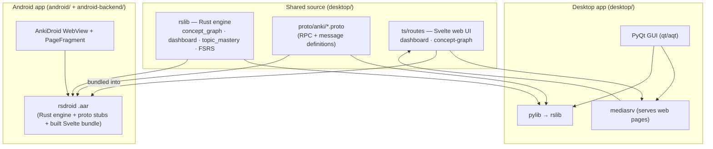

# Anki Speedrun — CFA Level 1 study app (desktop + mobile)

A fork of [Anki](https://apps.ankiweb.net) turned into a single-exam study app for
**CFA Level 1**. On top of Anki's spaced-repetition engine it adds a **readiness
dashboard**, a **concept-graph knowledge map**, an **answer-difficulty signal**, and
**contrast scheduling** — and ships the same features to **desktop** and **Android**.

This repository is a **monorepo** that combines three previously separate projects so the
desktop app, the Android app, and the shared backend bridge live and version together.

> **Heads-up:** combining the repos is a version-control convenience — the two apps still
> build with their own toolchains (desktop = `just`/ninja/cargo/yarn; Android = Gradle).
> Build each from its own folder as described below.

---

## Repository structure

```
anki-speedrun/
├── desktop/           # Anki desktop app (the fork) — Rust engine + Python/Qt + Svelte web UI
├── android/           # AnkiDroid (the Kotlin Android app)
├── android-backend/   # rsdroid — the bridge that compiles the Rust engine into an Android .aar
└── .gitmodules        # android-backend/anki (submodule → upstream Anki, used to build the .aar)
```

- **`desktop/`** — everything that was the standalone fork: the core Rust library (`rslib/`),
  the Python wrapper (`pylib/`), the PyQt GUI (`qt/aqt/`), the Svelte/TypeScript web UI
  (`ts/`), protobuf definitions (`proto/`), translations (`ftl/`), and the build system
  (`build/`, `justfile`). This is the "browser app" you launch during development.
- **`android/`** — the AnkiDroid app (Kotlin). Hosts the shared Svelte pages in a WebView and
  talks to the engine through the `.aar`.
- **`android-backend/`** — rsdroid. Compiles the desktop Rust engine + web assets into a
  `.aar` that AnkiDroid consumes, so Android devs don't need a Rust toolchain.

Historical design/planning docs live in `desktop/` (`DASHBOARD.md`, `PRD.md`,
`ANDROID_PORTING.md`, `PHASE*_PLAN*.md`, `GRILLING_NOTES.md`, …).

---

## Architecture

The engine and web UI are written **once** (in `desktop/`) and reused by both platforms:



- **Desktop** runs the Rust engine in-process (via `pylib`) and serves the Svelte pages from a
  local `mediasrv`, embedded in Qt web views.
- **Android** gets the _same_ Rust engine, protobuf stubs, and Svelte bundle packaged inside
  the rsdroid `.aar`; AnkiDroid loads the pages in a WebView and routes their backend calls to
  the `.aar`. See `desktop/ANDROID_PORTING.md` for the exact wiring.

---

## What's custom in this fork

All of the following are additions on top of stock Anki (mostly in `desktop/rslib/src/stats/`,
`desktop/ts/routes/`, and `desktop/proto/anki/stats.proto`):

- **CFA Readiness Dashboard** — three separate gauges (**Memory**, **Performance**,
  **Readiness**) mapped to the 10 CFA Level 1 topic areas, with a per-subject table, exam
  coverage, and an honest **give-up rule** (Readiness abstains until there is enough graded
  data). See `desktop/DASHBOARD.md`.
- **Concept graph** — a force-directed knowledge map: one node per reading/tag, edges where two
  readings co-occur on a note. Nodes are colored **by answer difficulty** (from your
  Again/Hard grades) by default, with a toggle to color **by FSRS recall**.
- **Answer-accuracy signal** — the Memory gauge and node colors are discounted by how
  accurately you've actually answered, so repeatedly failed/"Hard" topics read lower and turn
  red instead of showing full recall.
- **Contrast scheduling** — an optional queue-builder pass (deck-config toggle) in
  `rslib/src/scheduler/queue/builder/contrast.rs`.
- **New engine RPCs** — `GetDashboard`, `GetConceptGraph`, `TopicMastery` in
  `proto/anki/stats.proto`, computed in single SQL passes to stay fast on large collections.

---

## Running the desktop / browser app

All desktop commands run from the **`desktop/`** folder and go through the `just` task runner
(which wraps the ninja/cargo/yarn build and downloads the deps it needs).

### Prerequisites

- git, a C toolchain (Xcode CLT on macOS / Build Tools on Windows)
- [rustup](https://rustup.rs/) (Rust toolchain)
- Python 3 and [`just`](https://github.com/casey/just) (`cargo install just` or your package
  manager). Node, protoc, and uv are downloaded automatically by the build.
- See `desktop/docs/development.md` for the full list.

### Launch it

```bash
cd desktop
just run          # builds pylib + qt, then launches Anki (web views enabled)
```

While it's running, the web UI is served locally at
**`http://localhost:40000/_anki/pages/`** (e.g. `dashboard.html`, `concept-graph.html`) — so you
can open the CFA dashboard and concept map in a browser, or reach them in-app via the top
toolbar **"CFA Dashboard"** link and the per-deck gear menu **"Concept map"**.

### Development helpers

```bash
just web-watch      # live-rebuild the Svelte/SCSS web UI on change (run in a second terminal)
just run-optimized  # release-optimized build
just check          # format + build + full test/lint suite (run before committing)
just lint           # type-check + lint only (clippy / mypy / ruff / eslint / svelte / tsc)
just --list         # see all recipes
```

> **Monorepo note:** the desktop build now runs correctly from `desktop/` even though `.git`
> lives at the repo root (the build was patched to find it). If you ever move things around,
> keep running desktop commands from inside `desktop/`.

---

## Running the Android app (emulator)

Android commands run from the **`android/`** folder via Gradle.

### 1. Prerequisites

- **Android Studio** (recommended — gives you the SDK, an emulator, and a JDK), or the
  standalone Android command-line tools.
- A JDK (the one bundled with Android Studio is fine).

### 2. Install an emulator

Using Android Studio: **Device Manager → Create Device**, pick a phone + a recent system image,
and start it.

Or from the command line (adjust the ABI: `arm64-v8a` for Apple Silicon, `x86_64` for Intel):

```bash
sdkmanager "platform-tools" "emulator" "platforms;android-34" \
           "system-images;android-34;google_apis;arm64-v8a"
avdmanager create avd -n anki-test -k "system-images;android-34;google_apis;arm64-v8a"
emulator -avd anki-test        # boots the virtual device; leave it running
```

### 3a. Run stock AnkiDroid (quickest, uses the published backend)

This builds the Android app against the **published** rsdroid backend from Maven — no Rust
build needed. You get AnkiDroid, but **not** this fork's CFA features.

```bash
cd android
./gradlew installPlayDebug     # installs the debug APK onto the running emulator
adb shell monkey -p com.ichi2.anki.debug -c android.intent.category.LAUNCHER 1   # launch it
```

### 3b. Run with this fork's CFA features (local backend)

To get the concept graph / dashboard on Android you must build the rsdroid `.aar` **from the
fork** and tell AnkiDroid to use it. Summary (full details + the ~5 Kotlin wiring edits are in
**`desktop/ANDROID_PORTING.md`**):

1. **Point the backend at the fork.** `android-backend/` builds against its `anki` submodule,
   which by default is upstream Anki. Initialize it (or repoint it at this fork's engine in
   `desktop/`):
   ```bash
   git submodule update --init --recursive      # fetches android-backend/anki
   ```
2. **Build the `.aar`** (needs Rust + the Android NDK — see `android-backend/README.md`):
   ```bash
   cd android-backend
   ./build.sh                                    # or: ./gradlew :rsdroid:assembleRelease
   ```
3. **Tell AnkiDroid to use the local backend** — add to `android/local.properties`:
   ```
   local_backend=true
   ```
4. **Build & run** on the emulator:
   ```bash
   cd android
   ./gradlew installPlayDebug
   adb shell monkey -p com.ichi2.anki.debug -c android.intent.category.LAUNCHER 1
   ```
5. Open a deck's menu → **Concept map** to confirm the shared page renders. `adb logcat | grep
   -i _anki` should show a successful `POST /_anki/getConceptGraph`.

> The AnkiDroid Kotlin wiring for the concept-graph page (page allowlist, backend method
> dispatch, and the `ConceptGraph` fragment/entry point) is described step-by-step in
> `desktop/ANDROID_PORTING.md`.

---

## Testing & formatting

| Task            | Desktop (`cd desktop`)                             | Android (`cd android`)        |
| --------------- | -------------------------------------------------- | ----------------------------- |
| Build           | `just run` / `just run-optimized`                  | `./gradlew assemblePlayDebug` |
| Tests           | `just test-rust` / `just test-py` / `just test-ts` | `./gradlew test`              |
| Lint/type-check | `just lint`                                        | `./gradlew lint`              |
| Format          | `just fmt` / `just fix-fmt`                        | `./gradlew ktlintFormat`      |
| Everything      | `just check`                                       | —                             |

---

## Licenses

- Desktop / engine: [GNU AGPL v3](desktop/LICENSE).
- AnkiDroid: GPL-3.0 (see `android/COPYING`); the AnkiDroid API is LGPL-3.0.
- rsdroid backend: GPL-3.0, with the AGPL-3.0 Anki engine as a submodule.
