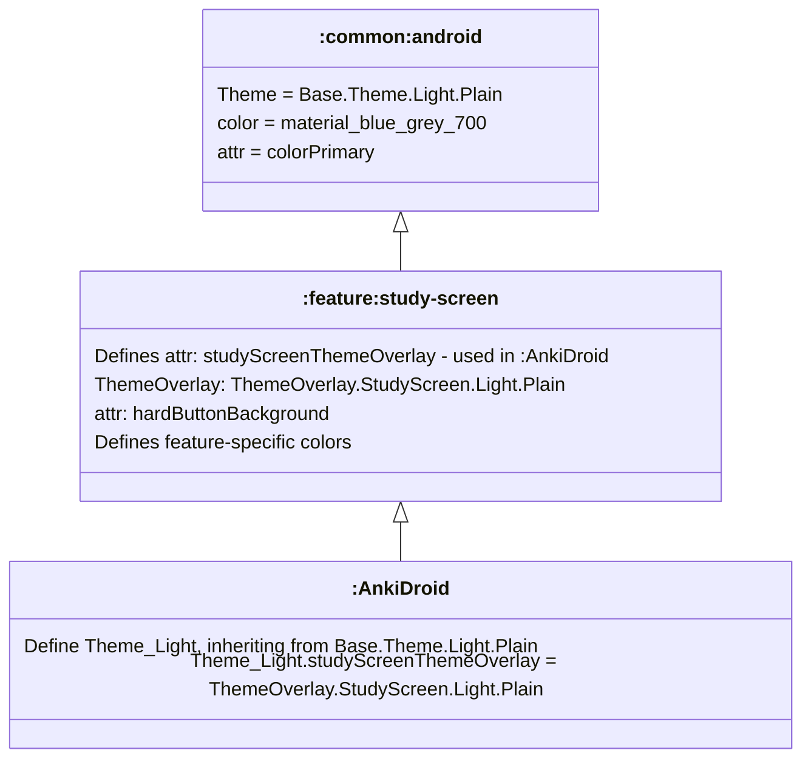

> [!CAUTION]
> This is a plan for how theming will work in XML-Views and is subject to change.  
> AnkiDroid will be Compose-first in the future.

# Multimodule theming


## Constraints

- **A module cannot reference up the dependency tree.** `:common:android` can only define attrs/styles, or depend on attrs/styles in a module it depends on.
- **Styles don't merge across modules.** A feature cannot contribute an `<item>` to a base theme it doesn't own.
- **Themes are applied by `setTheme`.** Resource qualifiers (`values-night`) are insufficiently powerful 
  to support two night themes: `Dark`/`Black`. 
- **[`nonTransitiveRClass=true`](https://developer.android.com/build/optimize-your-build?utm_source=android-studio-app&)**.
  Common code is in `CommonR` instead of `R` (see [`:common:android` README](../../common/android/README.md)).

## Layers

* `:common:android` defines base themes. All defined attrs must be common to multiple modules or
 well-known common attributes (Material Colors/Themes).
* `:feature:` modules may define a feature-specific `attr`, and a per-theme overlay (see below). This allows 
  resources (colors, attrs, etc.) to be tightly scoped to the feature. This is optional, the majority of 
  features will just use `attrs` defined in `:common:android`.
* `:AnkiDroid` defines the app-level themes. These inherit from the base themes, and set feature-level `attr`s.

Examples:



## `:feature` Overlays and theme-overlay pointers 

`:AnkiDroid` is responsible for wiring up themes, so adding a theme is a resource-only change, and 
 features are not responsible for theme dispatch logic.
 A theme-overlay pointer is used to move this decision to `:AnkiDroid`, which is defined in a 
 `:feature` as:

```xml
<!-- theme-overlay pointer -->
<attr name="studyScreenThemeOverlay" format="reference"/>

<!-- Theme overlay -->
<style name="ThemeOverlay.StudyScreen.Light.Plain" parent=""></style>
```

```kt
// in activity startup: setThemeOverlay aliases setTheme
setTheme(getResFromAttr(this, R.attr.studyScreenThemeOverlay))
```

#### in `:AnkiDroid`

```xml
<style name="Theme_Plain" parent="Base.Theme.Light.Plain">
    <item name="studyScreenThemeOverlay">@style/ThemeOverlay.StudyScreen.Light.Plain</item>
</style>
```