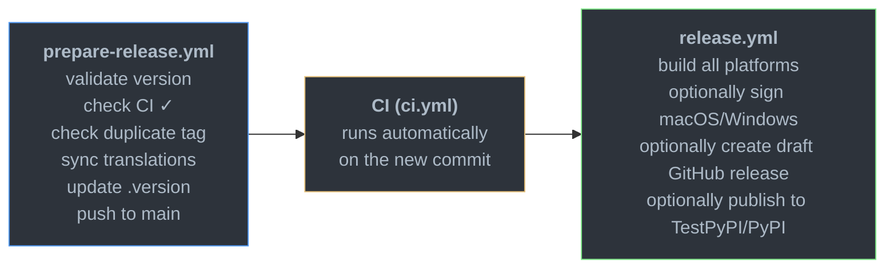
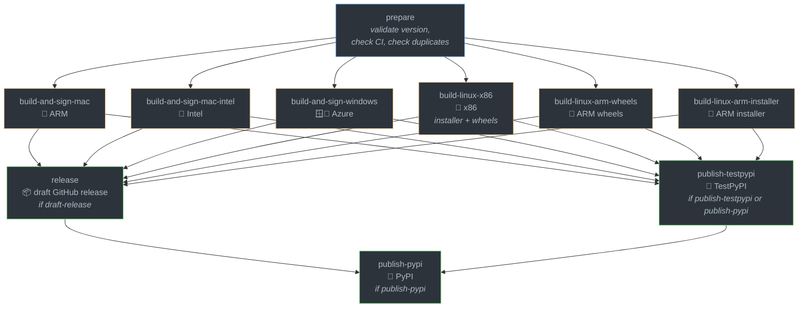
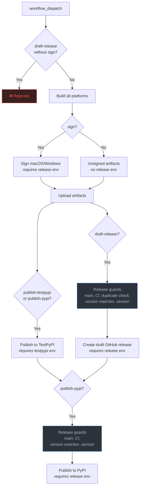

# Releasing

Releases are managed by two GitHub Actions workflows under `.github/workflows/`:

1. **`prepare-release.yml`** — Run first. Validates the version, checks that CI
   passed on main, syncs translations, updates `.version`, and pushes everything
   to main in a single commit. Normal CI then runs on the resulting commit.

2. **`release.yml`** — Run after CI passes on the prepared commit. Builds
   installers and wheels for all platforms (Linux x86/ARM, macOS Intel/ARM,
   Windows), and can optionally sign macOS/Windows artifacts, create a draft
   GitHub release, publish wheels to TestPyPI, and publish wheels to PyPI.

Both workflows are `workflow_dispatch` and share a `release` concurrency group so
they cannot run simultaneously.

## Release process overview



## Release workflow jobs



## Version format

Versions follow calendar versioning with PEP 440: `YY.MM` for stable releases
(e.g. `26.04`), with optional `.patch` (e.g. `26.04.1`) and pre-release
suffixes (`b1`, `rc1`, `a1`). Months must be zero-padded.

## Workflow inputs

**prepare-release:** takes a `version` string.

**release:** takes a `version` (must match `.version` on main for public
release operations) and four boolean inputs:

- `sign` signs macOS and Windows artifacts.
- `draft-release` creates the draft GitHub release.
- `publish-testpypi` publishes wheels to TestPyPI.
- `publish-pypi` publishes wheels to PyPI.

All four booleans default to `false`. Non-release runs use the `.version`
already in the repo, so builds work without a prepare step.

For a normal public release, enable all four booleans: `sign=true`,
`draft-release=true`, `publish-testpypi=true`, and `publish-pypi=true`.

## Environment gates

The release workflow uses GitHub
[environments](https://docs.github.com/en/actions/deployment/targeting-different-environments/using-environments-for-deployment)
as manual approval gates. Jobs that access signing credentials or publish
artifacts require a reviewer to approve the deployment before they run:

- **`release`** — Required when `sign`, `draft-release`, or `publish-pypi` is
  enabled. Protects code-signing secrets, the release token, and PyPI trusted
  publishing/OIDC.
- **`testpypi`** — Required by the TestPyPI publishing job. Allows test
  uploads to be gated separately from production releases.

When `sign` is disabled, the macOS and Windows build jobs run without the
`release` environment so they do not require approval and cannot access signing
secrets.

## Workflow input behavior

The `release.yml` workflow uses independent boolean inputs to control what gets
signed and published:

| Input              | Effect                                                                                                                                                                                                                                        |
| ------------------ | --------------------------------------------------------------------------------------------------------------------------------------------------------------------------------------------------------------------------------------------- |
| `sign`             | Signs macOS and Windows artifacts. Requires the `release` environment. When false, those jobs upload unsigned artifacts and do not access signing secrets.                                                                                    |
| `draft-release`    | Creates a draft GitHub release with generated release notes and installer artifacts. Requires `sign=true`, the `release` environment, main branch, passing CI, no duplicate tag/release, and `version` matching `.version`.                   |
| `publish-testpypi` | Publishes wheels to TestPyPI. Requires the `testpypi` environment.                                                                                                                                                                            |
| `publish-pypi`     | Publishes wheels to PyPI. Requires the `release` environment, main branch, passing CI, and `version` matching `.version`. It also runs and waits for the TestPyPI publish job first. It does not require signing unless `draft-release=true`. |
| `version`          | For `draft-release` or `publish-pypi`: must match `.version` on main. For build-only, signed-only, or TestPyPI-only runs: ignored (`.version` from the branch is used automatically).                                                         |



## Dispatching with just

Release workflows can be dispatched via `just` using the `release` module
defined in `release.just`. All recipes read the version from `.version`
automatically.

| Command                                                      | Description                                          |
| ------------------------------------------------------------ | ---------------------------------------------------- |
| `just release::build`                                        | Build-only from HEAD (all booleans false)            |
| `just release::build <ref>`                                  | Build-only from a specific branch                    |
| `just release::sign`                                         | Build and sign from HEAD                             |
| `just release::sign <ref>`                                   | Build and sign from a specific branch                |
| `just release::public`                                       | Full release from main (sign, draft, testpypi, pypi) |
| `just release::custom <ref> sign=true publish-testpypi=true` | Mix and match flags                                  |

Run `just --list --list-submodules` to see all available recipes.

## Testing the release workflow from a feature branch

`release.yml` can be dispatched from any branch for testing. The `main` branch
requirement only applies when `draft-release` or `publish-pypi` is enabled. To
run a test build:

1. Dispatch `release.yml` from your branch with all boolean inputs left false:
   ```
   just release::build <your-branch>
   ```
2. The workflow reads `.version` from the branch as-is (the version input is
   ignored for non-release runs), so no prepare step is needed.
3. All release guards (main-branch check, CI check, duplicate tag check) are
   skipped.
4. Artifacts are uploaded to the workflow run but nothing is published or tagged.

### Testing with code signing

To test the signing flow from a feature branch:

1. In the repo's Settings → Environments → `release`, temporarily add your
   branch to the allowed deployment branches.
2. Dispatch the workflow:
   ```
   just release::sign <your-branch>
   ```
3. Approve the environment deployment when prompted.
4. After testing, remove your branch from the environment's allowed branches.

> **Note:** `workflow_dispatch` workflows only appear in the GitHub Actions UI
> if the workflow file exists on the default branch. If `release.yml` is new or
> modified on your branch, use `gh workflow run` to trigger it — the UI
> dropdown won't show it until it's merged to main.

`prepare-release.yml` cannot be tested from a non-main branch — it
unconditionally requires `main`. To validate its scripts locally, run:

```
pip install 'packaging>=24,<26'
python3 .github/scripts/validate_version.py <version> <current_version>
```

## Important notes

- The release workflow builds the exact commit at `github.sha`. It does not
  write `.version` — that is done by the prepare workflow. If you dispatch
  release before prepare's commit has propagated, the build will use whatever
  `.version` was HEAD at dispatch time.
- `draft-release=true` with `sign=false` is rejected — draft releases must use
  signed installer artifacts.
- When `publish-pypi=true`, wheels are published to TestPyPI first, then to
  PyPI after the TestPyPI job succeeds. If `draft-release=true` is also set,
  PyPI publishing waits for the draft GitHub release to succeed too.

## Announcements

- Once a GitHub release draft is created, modify the generated changelog if necessary then click **Publish release**.
- Create a forum topic on the [Beta Testing](https://forums.ankiweb.net/c/anki/beta-testing/13) category. For stable releases, lock the topic and ask users to report issues on a new topic.
- For stable releases, update the version in [ankitects/anki-landing-page](https://github.com/ankitects/anki-landing-page) (See [example](https://github.com/ankitects/anki-landing-page/commit/2362eb2202f174df2aad1dc5336e1b5195a7af85)).
