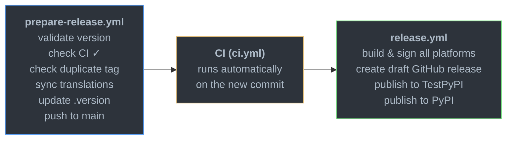
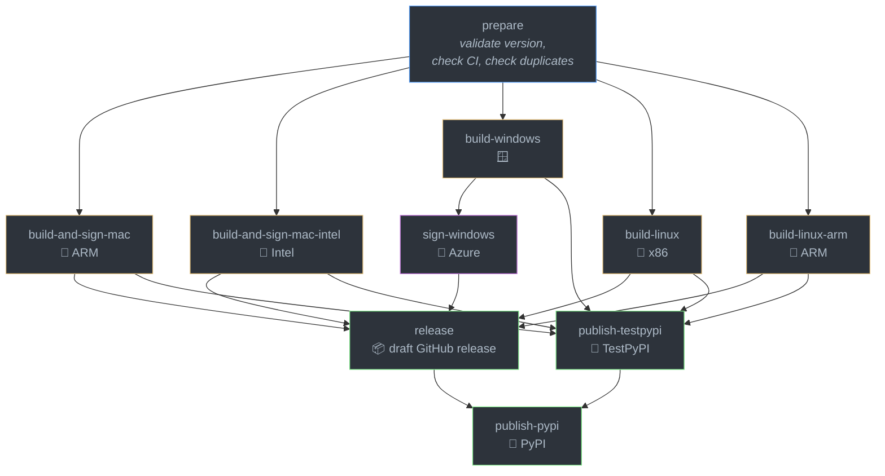

# Releasing

Releases are managed by two GitHub Actions workflows under `.github/workflows/`:

1. **`prepare-release.yml`** — Run first. Validates the version, checks that CI
   passed on main, syncs translations, updates `.version`, and pushes everything
   to main in a single commit. Normal CI then runs on the resulting commit.

2. **`release.yml`** — Run after CI passes on the prepared commit. Builds
   installers and wheels for all platforms (Linux x86/ARM, macOS Intel/ARM,
   Windows), signs them, creates a draft GitHub release, and publishes wheels to
   PyPI.

Both workflows are `workflow_dispatch` and share a `release` concurrency group so
they cannot run simultaneously.

## Release process overview



## Release workflow jobs



## Version format

Versions follow calendar versioning with PEP 440: `YY.MM` for stable releases
(e.g. `26.04`), with optional `.patch` (e.g. `26.04.1`) and pre-release
suffixes (`b1`, `rc1`, `a1`). Months must be zero-padded.

## Workflow inputs

**prepare-release:** takes a `version` string.

**release:** takes a `version` (must match `.version` on main for public
releases), a `skip-signing` boolean (builds unsigned artifacts), and a `publish`
choice (`none`, `testpypi`, or `release`). Non-release runs use the `.version`
already in the repo, so builds work without a prepare step.

## Environment gates

The release workflow uses GitHub
[environments](https://docs.github.com/en/actions/deployment/targeting-different-environments/using-environments-for-deployment)
as manual approval gates. Jobs that access signing credentials or publish
artifacts require a reviewer to approve the deployment before they run:

- **`release`** — Required by the macOS signing jobs, Windows signing job,
  the GitHub release job, and PyPI publishing. Protects code-signing secrets
  and prevents accidental public releases.
- **`testpypi`** — Required by the TestPyPI publishing job. Allows test
  uploads to be gated separately from production releases.

When `skip-signing` is enabled, the macOS build jobs run without the `release`
environment so they do not require approval (and cannot access signing secrets).

## Testing the release workflow from a feature branch

`release.yml` can be dispatched from any branch for testing — the `main`
branch requirement only applies when `publish=release`. To run a test build:

1. Dispatch `release.yml` from your branch with `publish=none` and
   `skip-signing=true`.
2. The workflow reads `.version` from the branch as-is (the version input is
   ignored for non-release runs), so no prepare step is needed.
3. All release guards (main-branch check, CI check, duplicate tag check) are
   skipped.
4. Artifacts are uploaded to the workflow run but nothing is published or tagged.

`prepare-release.yml` cannot be tested from a non-main branch — it
unconditionally requires `main`. To validate its scripts locally, run:

```
pip install 'packaging>=24,<26'
python3 .github/scripts/validate_version.py <version> <current_version>
```

## Important notes

- The release workflow builds the exact commit at `github.sha`. It does not
  write `.version` — that is done by the prepare workflow. If you dispatch
  release before prepare's commit has propagated, the build will use whatever
  `.version` was HEAD at dispatch time.
- `publish=release` with `skip-signing` is rejected — unsigned artifacts cannot
  be published.
- Wheels are published to TestPyPI first, then to PyPI after the GitHub release
  succeeds.
