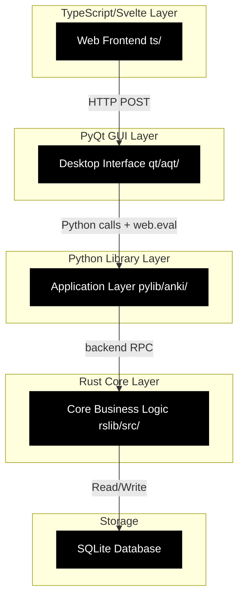
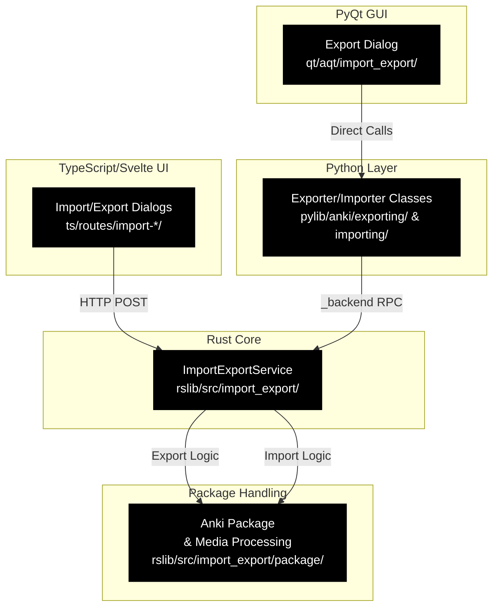
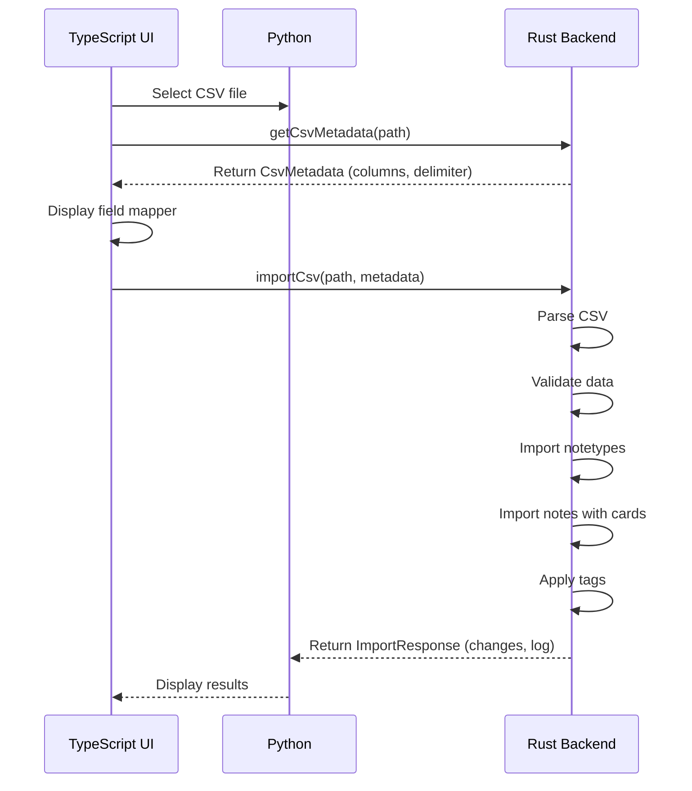
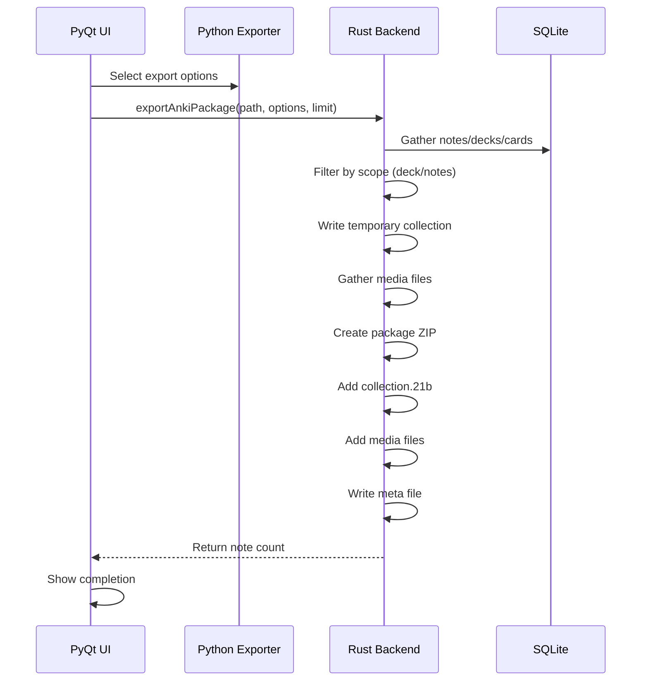

# Anki Project Technical Documentation

## Table of Contents

### Part 1: Core Architecture

1. [Executive Summary](#executive-summary)
2. [Architectural Overview](#architectural-overview)
3. [Directory Structure](#directory-structure)
4. [Architecture Layers](#architecture-layers)
   - [Layer 1: TypeScript/Svelte Web Frontend](#layer-1-typescriptsvelte-web-frontend)
   - [Layer 2: PyQt GUI](#layer-2-pyqt-gui)
   - [Layer 3: Python Library](#layer-3-python-library)
   - [Layer 4: Rust Core](#layer-4-rust-core)
   - [Layer 5: Protocol Buffers](#layer-5-protocol-buffers)

### Part 2: Core Systems

5. [Import/Export System](#importexport-system)
   - [Overview](#overview)
   - [Supported Formats](#supported-formats)
   - [Architecture Flow](#architecture-flow)
   - [Protocol Buffer Definitions](#protocol-buffer-definitions)
   - [Rust Implementation](#rust-implementation)
   - [Python Implementation](#python-implementation)
   - [PyQt GUI Implementation](#pyqt-gui-implementation)
   - [TypeScript/Svelte UI](#typescriptsvelte-ui)
   - [Anki Package Format](#anki-package-format)
   - [CSV Import Flow](#csv-import-flow)
   - [Anki Package Export Flow](#anki-package-export-flow)
   - [Media Handling](#media-handling)
   - [Import Response](#import-response)
   - [Common Use Cases](#common-use-cases)
   - [Performance Considerations](#performance-considerations)
6. [Build System](#build-system)
7. [Inter-Layer Communication](#inter-layer-communication)
8. [Data Flow Examples](#data-flow-examples)

### Part 3: Feature Systems

9. [Internationalization (i18n)](#internationalization-i18n)
10. [Synchronization Architecture](#synchronization-architecture)
11. [Media Management](#media-management)
12. [Scheduler Architecture (FSRS)](#scheduler-architecture-fsrs)
13. [Database Schema](#database-schema)

### Part 4: Extensibility & Configuration

14. [Addon System](#addon-system)
15. [Configuration Management](#configuration-management)

### Part 5: Testing & Quality

16. [Testing](#testing)
17. [Performance Optimization](#performance-optimization)

### Part 6: Development Tools

18. [Platform-Specific Code](#platform-specific-code)
19. [Security](#security)
20. [Deployment](#deployment)
21. [Key Development Patterns](#key-development-patterns)
22. [Debugging and Logging](#debugging-and-logging)
23. [Common Workflows](#common-workflows)

24. [Conclusion](#conclusion)

---

# Part 1: Core Architecture

## 1. Executive Summary

Anki is a spaced repetition flashcard program with a sophisticated multi-layered architecture that combines TypeScript/Svelte for web frontend, PyQt for desktop GUI, Python for application layer, and Rust for core business logic and performance-critical operations. Different layers communicate through Protocol Buffers (Protobuf), enabling type-safe cross-language RPC calls.

---

## 2. Architectural Overview

Anki follows a **three-layer architecture** with unidirectional RPC flow:



**Key Principles:**
- Each layer can make RPC calls to layers below it
- Python can invoke TypeScript functions via `web.eval()` (avoided when possible)
- Rust layers never make calls to upper layers
- All inter-layer communication uses Protocol Buffers for type safety

---

## 3. Directory Structure

### Root Level

```
anki/
├── ts/                  # TypeScript/Svelte web frontend
├── qt/                  # PyQt GUI application
│   └── aqt/            # Anki Qt GUI code
├── pylib/              # Python library
│   ├── anki/           # Core Python API
│   └── rsbridge/       # Rust-Python FFI bridge
├── rslib/              # Rust core library
│   └── src/           # Rust source code
├── proto/              # Protocol Buffer definitions
│   └── anki/          # .proto files for all services
├── build/              # Custom build system (Ninja-based)
│   ├── configure/      # Build configuration
│   ├── ninja_gen/      # Ninja file generator
│   └── runner/        # Build execution runner
├── ftl/               # Fluent translation files
├── docs/              # Project documentation
├── out/               # Generated output (auto-generated)
└── [config files]     # Cargo.toml, package.json, pyproject.toml, etc.
```

---

## 4. Architecture Layers

### Layer 1: TypeScript/Svelte Web Frontend (`ts/`)

### Purpose
Provides modern, responsive web-based UI components that are embedded in PyQt web views.

### Structure

```
ts/
├── lib/                      # Shared libraries
│   ├── components/           # Reusable Svelte components
│   ├── generated/           # Auto-generated backend clients
│   ├── sveltelib/          # Svelte utilities
│   └── domlib/            # DOM manipulation utilities
├── routes/                  # SvelteKit routes/pages
│   ├── deck-options/       # Deck configuration UI
│   ├── import-csv/         # CSV import interface
│   ├── card-info/          # Card statistics display
│   ├── graphs/            # Learning graphs
│   └── image-occlusion/   # Image occlusion editor
├── reviewer/                # Card reviewer interface
├── editor/                 # Card/note editor
├── tools/                  # Build tools
└── [config files]          # package.json, tsconfig.json, vite.config.ts
```

### Key Technologies
- **Framework:** Svelte 5.x with SvelteKit
- **Language:** TypeScript 5.x
- **Build Tool:** Vite 6.x
- **Styling:** SASS/SCSS with Bootstrap 5.x
- **Dependencies:**
  - `@bufbuild/protobuf` - Protobuf support
  - `@sveltejs/kit` - SvelteKit framework
  - `bootstrap` - UI framework
  - `codemirror` - Code editor
  - `fabric` - Canvas manipulation (for image occlusion)
  - `d3` - Data visualization
  - `marked` - Markdown rendering

### Communication with Python

TypeScript communicates with Python via **HTTP POST requests** to endpoints like `/_anki/methodName`:

```typescript
// Example from ts/lib/generated/post.ts
export async function postProto<T>(
    method: string,
    input: { toBinary(): Uint8Array; getType(): { typeName: string } },
    outputType: { fromBinary(arr: Uint8Array): T },
    options: PostProtoOptions = {},
): Promise<T> {
    const inputBytes = input.toBinary();
    const path = `/_anki/${method}`;
    const outputBytes = await postProtoInner(path, inputBytes);
    return outputType.fromBinary(outputBytes);
}
```

### Component Examples

- **ButtonGroup.svelte** - Grouped buttons
- **Select.svelte** - Dropdown selector
- **SpinBox.svelte** - Number input
- **HelpModal.svelte** - Help documentation viewer
- **BackendProgressIndicator.svelte** - Progress display for long operations

---

### Layer 2: PyQt GUI (`qt/aqt/`)

### Purpose
Desktop GUI wrapper that embeds web components, handles system integration, and provides native dialogs.

### Structure

```
qt/aqt/
├── __init__.py           # Application entry point, main setup
├── main.py              # AnkiQt main window class
├── reviewer.py          # Card reviewer UI
├── browser.py           # Card browser/search UI
├── addcards.py         # Add cards dialog
├── deckoptions.py      # Deck configuration UI
├── mediasrv.py         # Media server bridge
├── webview.py         # WebView wrapper
├── operations/        # Background operations
├── progress.py        # Progress dialog
├── utils.py          # Utility functions
├── theme.py          # Theme management
├── taskman.py        # Thread task manager
├── profiles.py       # Profile manager
├── data/web/        # Legacy web assets (copied from ts/)
└── [modules]        # Various UI components
```

### Key Components

**AnkiQt (`main.py`)**
- Main application window
- Manages profile lifecycle
- Coordinates between Python backend and web frontend
- Handles main event loop

**DialogManager (`__init__.py`)**
- Manages singleton dialogs
- Ensures only one instance per window type
- Handles cleanup on collection close

**Language Setup**
- Supports RTL languages
- Loads Qt translations
- Configures locale for Fluent/i18n

### Web Communication

PyQt communicates with TypeScript via `webview.eval()`:

```python
# Calling a TypeScript function from Python
self.web.eval("getTypedAnswer();")
```

### Main Loop

```python
def _run(argv: list[str] | None = None, exec: bool = True) -> AnkiApp | None:
    # 1. Setup profile manager
    pm = ProfileManager(base_folder)
    
    # 2. Create Qt application
    app = AnkiApp(argv)
    
    # 3. Setup language and backend
    backend = setupLangAndBackend(pm, app, opts.lang)
    
    # 4. Load main window
    mw = AnkiQt(app, pm, backend, opts, args)
    
    # 5. Enter event loop
    app.exec()
```

### Layer 3: Python Library (`pylib/`)

### Purpose
Application logic layer that wraps the Rust backend, provides high-level Python API, and handles integration concerns.

### Structure

```
pylib/
├── anki/                      # Core Python library
│   ├── collection.py          # Main Collection class
│   ├── cards.py              # Card management
│   ├── notes.py              # Note management
│   ├── decks.py              # Deck management
│   ├── models.py             # Note type (model) management
│   ├── scheduler/            # Scheduling logic (v3)
│   ├── media.py             # Media file management
│   ├── stats.py             # Statistics
│   ├── template.py          # Template rendering
│   ├── tags.py             # Tag management
│   ├── importing/           # Import functionality
│   ├── exporting/          # Export functionality
│   ├── _backend.py         # Rust backend wrapper
│   ├── _legacy.py          # Legacy compatibility
│   └── [modules]          # Other utilities
└── rsbridge/               # Rust-Python FFI bridge
    ├── lib.rs             # Rust FFI implementation
    └── pyproject.toml      # Python package config
```

### Key Classes

**Collection (`collection.py`)**
```python
class Collection:
    """Main entry point for Anki operations."""
    
    def __init__(self, path: str, backend: RustBackend, server: bool):
        self._backend = backend or RustBackend(server=server)
        self.db: DBProxy | None = None
        self.server = server
        # ... setup decks, cards, notes, etc.
```

**Key Responsibilities:**
- Database access proxy (via DBProxy)
- High-level API for CRUD operations
- Transaction management
- Undo/redo handling
- Scheduler integration

### Rust Backend Bridge (`_backend.py`)

```python
class RustBackend(RustBackendGenerated):
    """Python bindings for Anki's Rust libraries."""
    
    def __init__(self, langs: list[str] | None = None, server: bool = False):
        init_msg = backend_pb2.BackendInit(
            preferred_langs=langs,
            server=server,
        )
        self._backend = _rsbridge.open_backend(init_msg.SerializeToString())
```

**Important:** Direct backend access is discouraged. Use collection methods instead.

### Database Proxy

```python
# DBProxy provides safe database access
def db_query(self, sql: str, args: Sequence[ValueForDB], first_row_only: bool):
    return self._db_command(
        dict(kind="query", sql=sql, args=args, first_row_only=first_row_only)
    )
```

---

# Part 2: Core Systems

## 5. Import/Export System

### Overview

Anki's import/export system enables users to:
- **Export** decks and cards to various formats for sharing or backup
- **Import** external data into collections (CSV, Anki packages, JSON, etc.)

The system is distributed across all layers, with Rust handling core processing, Python providing compatibility layers, and TypeScript/Svelte offering modern UI.

### Supported Formats

| Format | Extension | Export | Import | Description |
|--------|-----------|--------|--------|-------------|
| Anki Package (with media) | `.apkg` | ✅ | ✅ | Full deck export with cards, notes, media, scheduling |
| Collection Package | `.colpkg` | ✅ | ✅ | Full collection backup (all decks) |
| Note CSV | `.csv` | ✅ | ✅ | Tab-separated note data |
| Card CSV | `.csv` | ✅ | ❌ | Tab-separated card data |
| Text (Notes) | `.txt` | ✅ | ❌ | Plain text note export |
| Text (Cards) | `.txt` | ✅ | ❌ | Plain text card export |
| Anki Package (Legacy) | `.anki2` | ✅ | ❌ | Old Anki format compatibility |
| JSON | `.json` | ❌ | ✅ | Structured data import |

### Architecture Flow



### Protocol Buffer Definitions

**Location:** `proto/anki/import_export.proto`

**Service:** `ImportExportService`

```protobuf
service ImportExportService {
  // Anki Package Import/Export
  rpc ImportAnkiPackage(ImportAnkiPackageRequest) returns (ImportResponse);
  rpc GetImportAnkiPackagePresets(generic.Empty) returns (ImportAnkiPackageOptions);
  rpc ExportAnkiPackage(ExportAnkiPackageRequest) returns (generic.UInt32);
  
  // CSV Import/Export
  rpc GetCsvMetadata(CsvMetadataRequest) returns (CsvMetadata);
  rpc ImportCsv(ImportCsvRequest) returns (ImportResponse);
  rpc ExportNoteCsv(ExportNoteCsvRequest) returns (generic.UInt32);
  rpc ExportCardCsv(ExportCardCsvRequest) returns (generic.UInt32);
  
  // JSON Import
  rpc ImportJsonFile(generic.String) returns (ImportResponse);
  rpc ImportJsonString(generic.String) returns (ImportResponse);
}
```

**Key Messages:**

- `ImportAnkiPackageRequest` - Package import with options
- `ExportAnkiPackageRequest` - Package export with options
- `ImportResponse` - Import results with changes and logs
- `CsvMetadata` - CSV format specifications
- `ExportLimit` - Scope of export (whole collection, deck, notes, cards)

### Rust Implementation

**Location:** `rslib/src/import_export/`

```
import_export/
├── service.rs           # Service implementation
├── mod.rs              # Module exports & error types
├── gather.rs           # Data gathering for export
├── insert.rs           # Data insertion for import
├── text/               # Text format handling
│   ├── import.rs      # CSV/JSON import logic
│   ├── csv/           # CSV-specific handling
│   └── json.rs        # JSON-specific handling
└── package/            # Anki package handling
    ├── apkg/          # .apkg format
    │   ├── export.rs  # Package export
    │   └── import/    # Package import
    │       ├── notes.rs  # Note import
    │       ├── decks.rs  # Deck import
    │       └── media.rs  # Media import
    ├── colpkg/         # .colpkg format
    └── media.rs         # Media processing
```

**Key Functions:**

**Export Flow:**
```rust
impl Collection {
    pub fn export_apkg(
        &mut self,
        out_path: impl AsRef<Path>,
        options: ExportAnkiPackageOptions,
        search: impl TryIntoSearch,
        media_fn: Option<Box<dyn FnOnce(HashSet<String>) -> MediaIter>>,
    ) -> Result<usize> {
        // 1. Create temporary collection file
        let temp_col = new_tempfile()?;
        
        // 2. Gather data from original collection
        let data = self.export_into_collection_file(&meta, temp_col_path, options, search, &mut progress)?;
        
        // 3. Gather media files
        let media = media_fn(data.media_filenames);
        
        // 4. Create package with collection and media
        export_collection(meta, temp_apkg.path(), &mut temp_col, col_size, media, &self.tr, &mut progress)?;
        
        // 5. Atomic rename
        atomic_rename(temp_apkg, out_path.as_ref(), true)?;
        Ok(data.notes.len())
    }
}
```

**Import Flow:**
```rust
impl Collection {
    pub fn import_apkg(
        &mut self,
        path: &str,
        options: ImportAnkiPackageOptions,
    ) -> Result<ImportResponse> {
        // 1. Extract package
        let package = Package::extract(path)?;
        
        // 2. Validate meta
        let meta = package.meta()?;
        
        // 3. Import notetypes (models)
        self.import_notetypes(package.notetypes, options.merge_notetypes)?;
        
        // 4. Import decks
        self.import_decks(package.decks)?;
        
        // 5. Import notes with cards
        self.import_notes(package.notes, options)?;
        
        // 6. Import media
        self.import_media(package.media)?;
        
        // 7. Return changes
        Ok(ImportResponse { changes, log })
    }
}
```

**Progress Tracking:**
```rust
pub enum ImportProgress {
    Extracting,      // Extracting package
    File,            // Reading file
    Gathering,        // Gathering data
    Media(usize),     // Processing media X/Y
    Notes(usize),     // Processing notes X/Y
}

pub enum ExportProgress {
    File,            // Writing file
    Gathering,        // Gathering data
    Notes(usize),     // Exporting notes X/Y
    Cards(usize),     // Exporting cards X/Y
    Media(usize),     // Copying media X/Y
}
```

**Error Handling:**
```rust
pub enum ImportError {
    Corrupt,              // Invalid package format
    TooNew,               // Collection too new for this version
    MediaImportFailed { info: String },
    NoFieldColumn,        // CSV missing field column
    EmptyFile,            // Empty input file
    NotetypeKindMergeConflict,  // Can't merge different notetype kinds
}
```

### Python Implementation

**Exporters:** `pylib/anki/exporting/`

**Base Exporter Class:**
```python
class Exporter:
    includeHTML: bool | None = None
    includeTags: bool | None = None
    includeSched: bool | None = None
    includeMedia: bool | None = None
    
    def __init__(self, col: Collection, did: DeckId | None, cids: list[CardId] | None):
        self.col = col
        self.did = did  # Deck ID or None for whole collection
        self.cids = cids  # Card IDs or None
    
    def doExport(self, path) -> None:
        raise Exception("not implemented")
    
    def exportInto(self, path: str) -> None:
        file = open(path, "wb")
        self.doExport(file)
        file.close()
```

**Exporter Types:**

1. **AnkiExporter** (`.anki2`) - Legacy format export
   - Exports cards, notes, decks, revlog
   - Includes scheduling info if enabled

2. **AnkiPackageExporter** (`.apkg`) - Modern package export
   - Creates zipped package with media
   - Calls Rust backend `export_anki_package()`

3. **NoteCsvExporter** - Note CSV export
   - Tab-separated format
   - Includes fields, tags, deck, notetype
   - Configurable HTML stripping

4. **CardCsvExporter** - Card CSV export
   - Tab-separated card data
   - Question/Answer format
   - Configurable HTML stripping

**Importers:** `pylib/anki/importing/`

**Base Importer Class:**
```python
class Importer:
    def __init__(self, col: Collection, file: str):
        self.col = col
        self.file = file
        self.log = []
    
    def run(self, media: None = None) -> None:
        raise Exception("not implemented")
```

**Importer Types:**

1. **Anki2Importer** (`.apkg`, `.anki2`) - Anki package import
   - Reads source collection
   - Maps decks and notetypes
   - Imports notes and cards
   - Handles media files
   - Preserves scheduling information

2. **TextImporter** (`.csv`, `.txt`) - CSV/text import
   - Auto-detects delimiter (tab, comma, semicolon, colon)
   - Maps columns to note fields
   - Handles duplicate resolution
   - Supports HTML or plain text

**CSV Configuration:**
```python
# CSV mapping options
class CsvMetadata:
    delimiter: Delimiter  # Auto-detected or forced
    is_html: bool         # Content type
    global_tags: list[str]  # Tags to add to all notes
    updated_tags: list[str]  # Tags to update on existing
    deck: DeckId | str | None  # Target deck
    notetype: NotetypeId | str | None  # Target note type
    field_columns: list[int]  # Column-to-field mapping
    dupe_resolution: DupeResolution  # How to handle duplicates
    
    class DupeResolution:
        UPDATE = 0      # Update existing notes
        PRESERVE = 1    # Keep existing notes
        DUPLICATE = 2    # Create duplicate notes
```

### PyQt GUI Implementation

**Location:** `qt/aqt/import_export/`

**Export Dialog:**
```python
class ExportDialog(QDialog):
    def __init__(self, mw: AnkiQt, did: DeckId | None, nids: Sequence[NoteId] | None):
        self.mw = mw
        self.col = mw.col
        self.nids = nids  # Note IDs (browser selection)
        
        # Available exporters
        self.exporter_classes = [
            ApkgExporter,
            ColpkgExporter,
            NoteCsvExporter,
            CardCsvExporter,
        ]
        
        # Setup UI with options
        self.setup_deck_selector()
        self.setup_export_options()
```

**Key Features:**
- Deck selector (whole collection or specific deck)
- Format selector (.apkg, .colpkg, .csv)
- Export scope options
  - Include scheduling info
  - Include deck configurations
  - Include media
  - HTML stripping
- Progress dialog with cancel support

**Import Operations:**
```python
# Import file dialog
def prompt_for_file_then_import(parent: QWidget) -> None:
    file, _ = getFile(
        parent,
        tr.importing_import(),
        filter="*.apkg *.colpkg *.csv *.json *.txt"
    )
    
    if file:
        if file.endswith('.csv'):
            import_csv_file(file)
        elif file.endswith('.apkg') or file.endswith('.colpkg'):
            import_collection_package(file)
        elif file.endswith('.json'):
            import_json_file(file)
```

### TypeScript/Svelte UI

**CSV Import Page:** `ts/routes/import-csv/`

**Structure:**
```
import-csv/
├── ImportCsvPage.svelte        # Main import page
├── FieldMapper.svelte          # Column-to-field mapping
├── FileOptions.svelte          # File type options
├── ImportOptions.svelte         # Import configuration
├── Preview.svelte              # Data preview
└── lib.ts                    # Import logic
```

**Field Mapping:**
```typescript
// Maps CSV columns to note fields
interface FieldMapper {
    field: string;           // Field name (Front, Back, etc.)
    column: number | null;    // Column index (1-based)
}
```

**Anki Package Import:** `ts/routes/import-anki-package/`

**Structure:**
```
import-anki-package/
├── ImportAnkiPackagePage.svelte  # Main import page
├── Header.svelte              # Import header with options
└── choices.ts                  # Import option choices
```

**Import Options:**
```typescript
interface ImportAnkiPackageOptions {
    merge_notetypes: boolean;      // Merge or replace note types
    update_notes: UpdateCondition;  // When to update existing notes
    update_notetypes: UpdateCondition;  // When to update notetypes
    with_scheduling: boolean;      // Include scheduling info
    with_deck_configs: boolean;     // Include deck settings
}

enum UpdateCondition {
    IfNewer = 0,    // Update if imported is newer
    Always = 1,       // Always update
    Never = 2,        // Never update
}
```

### Anki Package Format

**Structure:**
```
mydeck.apkg (ZIP file)
├── collection.21b    # SQLite collection (schema 11, zstd compressed)
├── media/             # Media files directory
│   ├── image1.jpg
│   ├── audio1.mp3
│   └── ...
└── media (optional)  # Legacy media map file
```

**Meta Information:**
```protobuf
message PackageMetadata {
    enum Version {
        VERSION_LEGACY_1 = 1;   // .anki (collection.anki2)
        VERSION_LEGACY_2 = 2;   // .apkg without meta (collection.anki21)
        VERSION_LATEST = 3;       // Modern .apkg (collection.21b)
    }
    
    Version version = 1;
}
```

**Media Entry:**
```protobuf
message MediaEntry {
    string name = 1;      // Media filename
    uint32 size = 2;     // File size in bytes
    bytes sha1 = 3;      // SHA-1 checksum
    optional uint32 legacy_zip_filename = 255;  // Legacy index
}
```

### CSV Import Flow



**Duplicate Resolution Strategies:**

1. **UPDATE** - Update existing notes with same first field
2. **PRESERVE** - Keep existing notes, don't import duplicates
3. **DUPLICATE** - Create duplicate notes (same GUID)

### Anki Package Export Flow



**Export Options:**
```protobuf
message ExportAnkiPackageOptions {
    bool with_scheduling = 1;      // Include card scheduling
    bool with_deck_configs = 2;     // Include deck settings
    bool with_media = 3;           // Include media files
    bool legacy = 4;             // Use legacy format
}

message ExportLimit {
    oneof limit {
        generic.Empty whole_collection = 1;  // All notes/cards
        int64 deck_id = 2;              // Specific deck
        notes.NoteIds note_ids = 3;       // Specific notes
        cards.CardIds card_ids = 4;       // Specific cards
    }
}
```

### Media Handling

**During Export:**
1. Collect all referenced media from notes
2. Copy to package `media/` directory
3. Create media map with SHA-1 checksums
4. Compress with zstd

**During Import:**
1. Extract media to temporary directory
2. Compare checksums with existing media
3. Import only new/changed files
4. Update media database
5. Cleanup temporary files

**Media Iteration:**
```rust
pub struct MediaIter {
    files: Vec<String>,
    index: usize,
}

impl Iterator for MediaIter {
    fn next(&mut self) -> Option<String> {
        if self.index < self.files.len() {
            let file = self.files[self.index].clone();
            self.index += 1;
            Some(file)
        } else {
            None
        }
    }
}
```

### Import Response

```protobuf
message ImportResponse {
    message Log {
        repeated Note new = 1;           // Newly imported notes
        repeated Note updated = 2;        // Updated notes
        repeated Note duplicate = 3;       // Duplicate notes (not imported)
        repeated Note conflicting = 4;      // Notes with conflicts
        repeated Note first_field_match = 5;  // Notes with same first field
        repeated Note missing_notetype = 6;  // Notes without matching notetype
        repeated Note missing_deck = 7;      // Notes without matching deck
        repeated Note empty_first_field = 8;  // Notes with empty first field
        CsvMetadata.DupeResolution dupe_resolution = 9;  // Used resolution
        uint32 found_notes = 10;       // Total notes in file
    }
    
    collection.OpChanges changes = 1;  // Database changes
    Log log = 2;                      // Import log
}
```

### Common Use Cases

**Export a Deck for Sharing:**
1. User selects deck in browser
2. Clicks "Export" → "Anki Package (.apkg)"
3. Sets "Include Media" option
4. Exports `.apkg` file with all media

**Import CSV File:**
1. User selects CSV file
2. Anki analyzes structure (delimiter, columns)
3. User maps columns to note fields
4. User selects target deck and notetype
5. Anki previews first N rows
6. User chooses duplicate resolution
7. Import processes with progress dialog
8. Results show new/updated/duplicate counts

**Backup Entire Collection:**
1. File → Export → "Export All"
2. Format: "Collection Package (.colpkg)"
3. Includes all decks, media, scheduling
4. Creates `.colpkg` file

### Performance Considerations

**Export Optimization:**
- Batch database queries
- Lazy media iteration
- Temporary file writing
- Atomic file operations

**Import Optimization:**
- Transaction-based imports
- Bulk inserts
- Prepared statements
- Checksum-based media deduplication

---

### Layer 4: Rust Core (`rslib/`)

### Purpose
Performance-critical business logic, storage, and core algorithms. The majority of Anki's functionality now lives here.

### Structure

```
rslib/
├── src/
│   ├── lib.rs                    # Library root
│   ├── backend/                  # Backend service implementations
│   │   ├── mod.rs              # Backend initialization
│   │   ├── collection.rs        # Collection service
│   │   ├── config.rs           # Config service
│   │   ├── sync.rs            # Sync service
│   │   ├── card_rendering.rs   # Card rendering
│   │   └── [services]        # Other services
│   ├── collection/              # Collection management
│   │   ├── mod.rs            # Collection struct
│   │   ├── backup.rs         # Backup handling
│   │   ├── transact.rs      # Transaction logic
│   │   └── undo.rs          # Undo/redo
│   ├── scheduler/               # Scheduling logic
│   │   ├── mod.rs           # Scheduler v3
│   │   ├── answering/        # Answer processing
│   │   ├── new.rs           # New card scheduling
│   │   ├── reviews.rs        # Review scheduling
│   │   ├── fsrs/           # FSRS algorithm
│   │   ├── queue/           # Card queues
│   │   └── states/          # Card states
│   ├── decks/                  # Deck management
│   ├── cards/                  # Card management
│   ├── notes/                  # Note management
│   ├── notetype/               # Note types (models)
│   ├── deckconfig/             # Deck configuration
│   ├── media/                  # Media handling
│   ├── storage/                # SQLite storage layer
│   │   ├── sqlite.rs         # SQLite wrapper
│   │   ├── schema11.sql      # Database schema
│   │   ├── upgrades/         # Schema migrations
│   │   └── [tables]         # Table-specific storage
│   ├── sync/                   # Sync protocol
│   ├── search/                 # Search functionality
│   ├── stats/                  # Statistics
│   ├── import_export/          # Import/Export
│   ├── template/               # Template engine
│   ├── i18n/                  # Internationalization
│   ├── error/                  # Error handling
│   ├── services/               # Protobuf service traits
│   └── [modules]              # Other functionality
└── rust_interface.rs           # Auto-generated interface
```

### Backend Structure

```rust
pub struct Backend(Arc<BackendInner>);

pub struct BackendInner {
    col: Mutex<Option<Collection>>,
    pub(crate) tr: I18n,
    server: bool,
    sync_abort: Mutex<Option<AbortHandle>>,
    progress_state: Arc<Mutex<ProgressState>>,
    runtime: OnceLock<Runtime>,
    state: Mutex<BackendState>,
    backup_task: Mutex<Option<JoinHandle<Result<()>>>>,
    media_sync_task: Mutex<Option<JoinHandle<Result<()>>>>,
    web_client: Mutex<Option<Client>>,
}
```

### Key Services

1. **CollectionService** - Main collection operations
2. **DeckService** - Deck CRUD operations
3. **CardService** - Card CRUD operations
4. **NoteService** - Note CRUD operations
5. **SchedulerService** - Card scheduling (FSRS v3)
6. **ConfigService** - Configuration management
7. **MediaService** - Media file operations
8. **SyncService** - Collection synchronization
9. **SearchService** - Card search
10. **StatsService** - Statistics generation

### Storage Layer

**SQLite-based storage** with the following main tables:

- `notes` - Note data
- `cards` - Card data and scheduling info
- `decks` - Deck configuration
- `revlog` - Review history
- `tags` - Tag definitions
- `graves` - Deleted items
- `notetypes` - Note type definitions

**Schema migrations** handled in `storage/upgrades/`

### Error Handling

```rust
// Uses snafu for error handling
pub type Result<T, E = AnkiError> = std::result::Result<T, E>;

#[derive(Debug, Snafu)]
pub enum AnkiError {
    InvalidInput { message: String },
    UndoEmpty,
    Interrupted,
    TemplateParse { message: String },
    IOError { source: std::io::Error },
    DBError { source: rusqlite::Error },
    NetworkError,
    // ... more variants
}
```

### Scheduler v3 (FSRS)

- Algorithm: Free Spaced Repetition Scheduler (FSRS)
- Location: `scheduler/fsrs/`
- States: `scheduler/states/`
- Queues: `scheduler/queue/`
- Features:
   - Adaptive intervals
   - Retention prediction
   - Difficulty calculation
   - Stability tracking

### Layer 5: Protocol Buffers (`proto/`)

### Purpose
Define the contract between layers, enabling type-safe cross-language communication.

### Structure

```
proto/anki/
├── backend.proto           # Backend initialization & error types
├── collection.proto        # Collection operations
├── cards.proto            # Card types & operations
├── notes.proto            # Note types & operations
├── decks.proto            # Deck types & operations
├── deck_config.proto      # Deck configuration
├── notetypes.proto        # Note type definitions
├── scheduler.proto        # Scheduling types (FSRS)
├── card_rendering.proto   # Card rendering
├── search.proto          # Search queries
├── import_export.proto    # Import/export
├── sync.proto           # Sync protocol
├── stats.proto          # Statistics
├── config.proto         # Configuration
├── media.proto         # Media operations
├── tags.proto          # Tag operations
├── links.proto         # Help page links
├── i18n.proto        # Internationalization
├── generic.proto      # Generic types
├── frontend.proto     # Frontend (Python/TS) service
├── ankiweb.proto     # AnkiWeb integration
├── ankidroid.proto   # AnkiDroid integration
├── ankihub.proto     # AnkiHub integration
└── image_occlusion.proto  # Image occlusion
```

### Service Definitions

```protobuf
// Example: DecksService
service DecksService {
  rpc NewDeck(generic.Empty) returns (Deck);
  rpc UpdateDeck(Deck) returns (OpChanges);
  rpc GetDeck(DeckId) returns (Deck);
  rpc GetAllDecks(generic.Empty) returns (DeckList);
  rpc RemoveDeck(DeckId) returns (OpChangesWithCount);
  // ... more methods
}
```

### Message Types

```protobuf
// Example: Deck message
message Deck {
  int64 id = 1;
  string name = 2;
  uint64 mtime_secs = 3;
  bool common = 4;
  int64 config_id = 5;
  bool limited = 6;
  DeckConfig config = 7;
  // ... more fields
}
```

### Code Generation

**Rust:** `rslib/rust_interface.rs` (auto-generated)
- Generated from proto files during build
- Uses `prost` for Rust code generation
- Creates service traits and message types

**Python:** `pylib/anki/*_pb2.py` (auto-generated)
- Generated during build
- Uses `mypy-protobuf`
- Accessible via aliases (e.g., `Deck` instead of `decks_pb2.Deck`)

**TypeScript:** `ts/lib/generated/` (auto-generated)
- Generated during build
- Uses `@bufbuild/protobuf`
- Exports: `@generated/anki/*_pb` and `@generated/backend`

---

## 6. Build System (`build/`)

### Purpose
Custom Ninja-based build system that orchestrates Rust, Python, and TypeScript builds.

### Structure

```
build/
├── configure/           # Build configuration & detection
├── ninja_gen/          # Ninja file generator (Rust)
│   └── src/
│       ├── build.rs    # Build rules definition
│       └── [modules]  # Various build steps
└── runner/            # Build execution runner (Rust)
    └── src/
        └── main.rs    # Entry point
```

### Build Process

```bash
# Main command
./check              # Format and check everything

# Ninja wrapper
./ninja <target>     # Build specific target

# Common targets
./ninja build         # Full build
./ninja check         # Run checks
./ninja format        # Format code
./ninja wheels        # Build Python wheels
./ninja check:svelte  # Check TypeScript/Svelte
```

### Build Flow

1. **Configure Phase** (`build/configure/`)
   - Detect system capabilities
   - Find dependencies (Node, Python, Rust, etc.)
   - Generate build configuration

2. **Ninja Generation** (`build/ninja_gen/`)
   - Read configuration
   - Generate `build.ninja` file
   - Define build rules and dependencies

3. **Build Execution** (`build/runner/`)
   - Execute `build.ninja`
   - Run build steps in parallel
   - Handle errors and retries

### Language-Specific Builds

**Rust:**
```bash
cargo check          # Quick check
cargo build         # Build
cargo test          # Run tests
```

**Python:**
```bash
./tools/dmypy       # Type checking
./ninja wheels      # Build wheels
```

**TypeScript:**
```bash
./ninja check:svelte   # Check Svelte
cd ts && npm run dev   # Dev server
cd ts && npm run build  # Production build
```

### Output Directory

```
out/
├── rust/              # Rust build artifacts
├── pylib/anki/        # Generated Python files
├── qt/_aqt/          # Generated Qt files
├── ts/lib/generated/  # Generated TypeScript files
└── [platforms]       # Platform-specific binaries
```

---

## 7. Inter-Layer Communication

### Python → Rust (Protobuf RPC)

**Definition:** `proto/anki/*.proto`

**Call:** `pylib/anki/*.py`
```python
# In decks.py
def new_deck(self) -> DeckDict:
    return self.col._backend.new_deck()
```

**Implementation:** `rslib/src/*/service.rs`
```rust
// In decks/service.rs
fn new_deck(&mut self) -> error::Result<anki_proto::decks::Deck> {
    // Implementation
}
```

**Bridge:** `pylib/rsbridge/lib.rs`
```rust
#[pymodule]
fn rsbridge(_py: Python, m: &PyModule) -> PyResult<()> {
    m.add_function(wrap_pyfunction!(open_backend, m)?)?;
    // ...
}
```

### TypeScript → Python (HTTP POST)

**TypeScript:**
```typescript
import { postProto } from "@generated/post";
import { newDeck } from "@generated/backend";

const deck = await postProto("newDeck", {}, newDeck);
```

**Python (via Axum):**
```python
# Handled by Rust backend's Axum server
# Routes defined automatically from proto services
POST /_anki/methodName → BackendService::method()
```

### Python → TypeScript (web.eval)

**Python:**
```python
self.web.eval("anki.deckOptionsPendingChanges();")
```

**TypeScript:**
```typescript
// In a Svelte component
globalThis.anki.deckOptionsPendingChanges = async () => {
    // Implementation
    await postProto(...); // Post back to backend
};
```

---

## 8. Data Flow Examples

### Adding a New Card

1. **User Interaction** (TypeScript/Svelte)
   - User fills form in editor UI
   - Calls `addNote()` via `postProto()`

2. **HTTP Request**
   - POST `/_anki/add_note`
   - Protobuf-encoded `AddNoteRequest`

3. **Python Layer**
   - `Collection.add_note()`
   - Validates input
   - Calls `_backend.add_note()`

4. **Rust Layer**
   - `NoteService::add_note()`
   - Generates note ID
   - Creates cards from note
   - Stores in SQLite
   - Returns `OpChanges`

5. **Response**
   - Protobuf response back through layers
   - UI updates with new card

### Reviewing a Card

1. **User Interaction**
   - User clicks "Show Answer"
   - TypeScript calls `answerCard()` via `postProto()`

2. **Rust Processing**
   - `SchedulerService::answer_card()`
   - Calculates next interval (FSRS)
   - Updates card in database
   - Schedules next review

3. **Response**
   - Returns `OpChanges` with new card
   - UI updates with next card

---

# Part 3: Feature Systems

## 9. Internationalization (i18n)

### Fluent-based Translation System

**Location:** `ftl/`

```
ftl/
├── core/                # Core application strings
│   ├── core-repo.ftl  # English source
│   └── [languages]/   # Translations
└── qt/                # Qt-specific strings
    ├── qt-repo.ftl    # English source
    └── [languages]/   # Translations
```

### Auto-Generated Translation API

**Rust:** `rslib/i18n/src/`
```rust
pub struct I18n {
    // Auto-generated translation methods
    pub fn decks_new_deck(&self) -> String { /* ... */ }
}
```

**Python:** `pylib/anki/_fluent.py` (auto-generated)

**TypeScript:** `ts/lib/generated/ftl-helpers.ts` (auto-generated)

### Usage

**Rust:**
```rust
tr.browsing_add_notes(notes_count)
```

**Python:**
```python
from anki.lang import tr
tr.browsing_add_notes(notes_count=5)
```

**TypeScript:**
```typescript
import { tr } from "@generated/ftl-helpers";
tr.browsingAddNotes({ count: 5 });
```

---

## 10. Synchronization Architecture

### Components

**Location:** `rslib/src/sync/`

```
sync/
├── collection/        # Collection sync
├── media/           # Media sync
├── http_client/     # HTTP client
├── http_server/     # HTTP server (for syncserver)
├── login.rs        # Authentication
├── version.rs      # Version negotiation
└── response.rs     # Response handling
```

### Sync Flow

1. **Login**
   - User enters credentials
   - `SyncAuth` token obtained
   - Stored for future syncs

2. **Collection Sync**
   - Compare local vs remote timestamps
   - Detect conflicts
   - Merge changes
   - Update both sides

3. **Media Sync**
   - Compare media checksums
   - Upload missing files
   - Download missing files
   - Remove deleted files

### Sync Server Mode

```bash
# Run Anki as sync server
anki --syncserver
```

**Implementation:**
- Rust backend runs sync server
- Uses Axum HTTP framework
- Exposes sync endpoints
- Handles authentication and media serving

---

## 11. Media Management

### Storage

**Location:** `media/` (next to collection)

**Database:** `media.db` (SQLite)
- Tables: media, log

**Operations:**

**Rust Layer:** `rslib/src/media/`
```rust
// Check for unused files
fn check_media_db(&mut self, input: CheckMediaIn) -> Result<CheckMediaOut>

// Trash unused files
fn trash_media_files(&mut self, input: TrashMediaFilesIn) -> Result<OpChanges>
```

**Python Layer:** `pylib/anki/media.py`
```python
class MediaManager:
    def __init__(self, col: Collection, media_dir: str):
        self.col = col
        self.dir = media_dir
```

### Media Server

**Location:** `qt/aqt/mediasrv.py`

**Purpose:** Serve media files to web views

**Implementation:**
- Python HTTP server
- Runs on localhost
- Serves files from media directory
- Handles Range requests for media playback

---

## 12. Scheduler Architecture (FSRS)

### Algorithm

**FSRS v3** - Free Spaced Repetition Scheduler

**Key Concepts:**
- **Stability** - How long a memory lasts
- **Difficulty** - Hardness of the card
- **Desired Retention** - Target probability of recall (default 90%)

### Components

**`rslib/src/scheduler/fsrs/`**
- FSRS algorithm implementation
- Parameter optimization
- Memory model

**`rslib/src/scheduler/states/`**
- Card states (New, Learning, Review, Relearning)
- State transitions
- Step handling

**`rslib/src/scheduler/queue/``
- Card queues
- Priority handling
- Scheduling order

**`rslib/src/scheduler/answering/`**
- Answer processing
- Rating handling (Again, Hard, Good, Easy)
- Interval calculation

### Scheduling Flow

1. **Fetch Next Card**
   - `SchedulerService::answer_due()`
   - Get card from queue
   - Render card

2. **User Answers**
   - User selects rating
   - `SchedulerService::answer_card()`
   - Calculate new interval (FSRS)
   - Update card state
   - Schedule next review

3. **Update Database**
   - Store new parameters
   - Log review (revlog)
   - Update FSRS memory state

---

## 13. Database Schema

### Schema Version 11

**Location:** `rslib/src/storage/schema11.sql`

**Key Tables:**

```sql
-- Notes
CREATE TABLE notes (
    id              INTEGER NOT NULL,
    guid            TEXT NOT NULL,
    mid             INTEGER NOT NULL,
    mod             INTEGER NOT NULL,
    usn             INTEGER NOT NULL,
    tags            TEXT NOT NULL,
    flds            TEXT NOT NULL,
    sfld            TEXT NOT NULL,
    csum            INTEGER NOT NULL,
    flags            INTEGER NOT NULL,
    data            TEXT NOT NULL,
    PRIMARY KEY (id)
);

-- Cards
CREATE TABLE cards (
    id              INTEGER NOT NULL,
    nid             INTEGER NOT NULL,
    did             INTEGER NOT NULL,
    ord             INTEGER NOT NULL,
    mod             INTEGER NOT NULL,
    usn             INTEGER NOT NULL,
    type            INTEGER NOT NULL,
    queue           INTEGER NOT NULL,
    due             INTEGER NOT NULL,
    ivl             INTEGER NOT NULL,
    factor           INTEGER NOT NULL,
    reps            INTEGER NOT NULL,
    lapses          INTEGER NOT NULL,
    left            INTEGER NOT NULL,
    odue            INTEGER NOT NULL,
    odid            INTEGER NOT NULL,
    flags            INTEGER NOT NULL,
    data            TEXT NOT NULL,
    PRIMARY KEY (id)
);

-- Decks
CREATE TABLE decks (
    id              INTEGER NOT NULL,
    name            TEXT NOT NULL,
    mtime_secs      INTEGER NOT NULL,
    usn             INTEGER NOT NULL,
    common          INTEGER NOT NULL,
    config_id       INTEGER NOT NULL,
    limited         INTEGER NOT NULL,
    PRIMARY KEY (id)
);

-- Revlog (Review History)
CREATE TABLE revlog (
    id              INTEGER NOT NULL,
    cid             INTEGER NOT NULL,
    usn             INTEGER NOT NULL,
    ease            INTEGER NOT NULL,
    ivl             INTEGER NOT NULL,
    lastIvl         INTEGER NOT NULL,
    factor           INTEGER NOT NULL,
    time            INTEGER NOT NULL,
    type            INTEGER NOT NULL,
    PRIMARY KEY (id)
);

-- Tags
CREATE TABLE tags (
    tag             TEXT NOT NULL,
    usn             INTEGER NOT NULL,
    PRIMARY KEY (tag)
);

-- Graves (Deleted Items)
CREATE TABLE graves (
    usn             INTEGER NOT NULL,
    oid             INTEGER NOT NULL,
    type            INTEGER NOT NULL,
    PRIMARY KEY (oid)
);
```

### Indexes & Constraints

```sql
CREATE UNIQUE INDEX idx_notes_guid ON notes (guid);
CREATE INDEX idx_cards_nid ON cards (nid);
CREATE INDEX idx_cards_did ON cards (did);
CREATE INDEX idx_cards_sched ON cards (due, queue);
CREATE INDEX idx_revlog_cid ON revlog (cid);
```

### Storage Implementation

**Rust Wrapper:** `rslib/src/storage/sqlite.rs`

**Features:**
- Connection pooling
- Transaction management
- Prepared statement caching
- Error handling with context
- Performance monitoring

---

# Part 4: Extensibility & Configuration

## 14. Addon System

### Location: `qt/aqt/addons/`

### Key Files

- `__init__.py` - Addon manager
- `download.py` - Addon downloader
- `dialogs.py` - Addon dialogs

### Addon Hooks

**Event System:** `aqt/gui_hooks.py`

```python
# Available hooks
gui_hooks.main_window_did_init.append(func)
gui_hooks.deck_browser_did_load_deck.append(func)
gui_hooks.reviewer_did_show_answer.append(func)
gui_hooks.card_did_render.append(func)
# ... many more
```

### Addon Structure

```
addons/
└── myaddon/
    ├── __init__.py       # Addon entry point
    ├── manifest.json     # Metadata
    ├── ui/             # UI files
    └── [assets]        # Images, etc.
```

### API Access

**Python:**
```python
import aqt
import aqt.gui_hooks
from anki import hooks
```

**TypeScript (via injected global):**
```typescript
globalThis.anki = {
    // Addon-provided functions
};
```

---

## 15. Configuration Management

### Locations

**Python:** `pylib/anki/config.py`

**Rust:** `rslib/src/config/`

**Storage:** Collection config stored in JSON in database

### Config Keys

```python
# Deck config
config = {
    "newPerDay": 20,
    "reviewPerDay": 100,
    "laps": 8,
    "leechThresh": 16,
    "leechFails": 8,
    # ... FSRS params
}
```

### Configuration Flow

1. **Rust Layer:** `ConfigService::get_config()`
2. **Serialization:** JSON format
3. **Storage:** In SQLite `config` table
4. **Type Safety:** Protobuf for config messages

---

# Part 5: Testing & Quality

## 16. Testing

### Rust Tests

**Location:** `rslib/tests/`

**Run:** `cargo test`

### Python Tests

**Location:** `pylib/tests/`

**Run:** `pytest`

### TypeScript Tests

**Location:** `ts/` (test files alongside source)

**Run:** `npm run vitest`

### Integration Tests

**Location:** `qt/tests/`

**Run:** Platform-specific test harness

---

---

## 17. Performance Optimization

### Rust Optimizations

**Profile:** `[profile.dev.package."*"] opt-level = 1`

**Key Optimizations:**
- SHA2 performance (21x faster with opt-level 1)
- SQLite prepared statement caching
- Batch operations
- Efficient serialization

### Python Optimizations

- Connection pooling
- Prepared statements
- Lazy loading
- Caching frequently accessed data

### TypeScript Optimizations

- Code splitting
- Lazy loading of routes
- Virtual scrolling for large lists
- Debounced user input

---

# Part 6: Development Tools

## 18. Platform-Specific Code

### Windows

**Location:** `qt/windows/`

**Features:**
- Speech synthesis
- Windows registry integration
- Auto-start on login

### macOS

**Location:** `qt/mac/`

**Features:**
- App bundle generation
- macOS-specific UI
- Spotlight integration

### Linux

**Features:**
- Desktop entry files
- AppImage generation
- Wayland support (experimental)

---

## 19. Security

### Certificate Handling

**System Certificates:** `pip_system_certs`

**Purpose:** Use system certificate store for HTTPS connections

### Authentication

**Sync Auth:**
- AnkiWeb account authentication
- Token-based auth
- Password encryption

### Sandboxing

**WebViews:**
- Local file access only
- No external network (except media server)
- Content Security Policy

---

## 20. Deployment

### Build Distribution

**Linux:**
- AppImage
- Debian/Ubuntu packages
- Arch AUR

**macOS:**
- DMG installer
- App bundle
- Notarization

**Windows:**
- NSIS installer
- ZIP archive
- Code signing

### Launcher

**Location:** `qt/launcher/`

**Purpose:** Self-contained launcher that:
- Checks for updates
- Handles single-instance
- Manages profiles
- Launches main application

---

## 21. Key Development Patterns

### 1. Service Pattern (Rust)

```rust
// Define service trait (auto-generated)
pub trait DecksService {
    fn new_deck(&mut self) -> Result<Deck>;
    fn update_deck(&mut self, deck: Deck) -> Result<OpChanges>;
}

// Implement for Collection
impl DecksService for Collection {
    fn new_deck(&mut self) -> Result<Deck> {
        // Implementation
    }
}
```

### 2. Proxy Pattern (Python)

```python
class DeckManager:
    """High-level API for deck operations."""
    
    def __init__(self, col: Collection):
        self.col = col
    
    def new_deck(self) -> DeckDict:
        """Create a new deck."""
        result = self.col._backend.new_deck()
        return convert_to_python(result)
```

### 3. Observer Pattern (Hooks)

```python
# Python hooks
hooks.card_added.append(func)

# TypeScript hooks
globalThis.anki.cardDidRender = (data) => {
    // React to card rendering
};
```

### 4. Command Pattern (Undo/Redo)

```rust
// Operations return OpChanges
pub struct OpChanges {
    pub card: u32,
    pub note: u32,
    pub deck: u32,
    pub tag: u32,
    pub notetype: u32,
}

// Undo/Redo via transaction log
```

---

## 22. Debugging and Logging

### Rust Logging

**Framework:** `tracing`

**Configuration:** Environment variables
```bash
RUST_LOG=anki=debug,anki::scheduler=trace
```

### Python Logging

**Framework:** Standard library `logging`

**Configuration:** `aqt/log.py`

### TypeScript Logging

**Framework:** Console

**Backend:** Via Python logger

### Debug Console

**Location:** `qt/aqt/debug_console.py`

**Purpose:** Interactive Python console for debugging

---

## 23. Common Workflows

### Adding a New Backend RPC

1. **Define in Proto:**
```protobuf
// proto/anki/decks.proto
service DecksService {
  rpc DoSomething(Request) returns (Response);
}
```

2. **Implement in Rust:**
```rust
// rslib/src/decks/service.rs
impl DecksService for Collection {
    fn do_something(&mut self, input: Request) -> Result<Response> {
        // Implementation
    }
}
```

3. **Build:** `./check`

4. **Use in Python:**
```python
# pylib/anki/decks.py
def do_something(self, arg: str) -> dict:
    result = self.col._backend.do_something(request=arg)
    return convert_to_python(result)
```

5. **Use in TypeScript (if needed):**
```typescript
import { doSomething } from "@generated/backend";
await doSomething({ field: "value" });
```

### Modifying Database Schema

1. **Update SQL:**
```sql
-- rslib/src/storage/schema11.sql
ALTER TABLE notes ADD COLUMN new_column TEXT;
```

2. **Add Migration:**
```rust
// rslib/src/storage/upgrades/schema11.rs
fn upgrade_to_12(col: &mut Collection) -> Result<()> {
    col.storage.db.execute_batch("ALTER TABLE notes ADD COLUMN new_column TEXT")?;
    Ok(())
}
```

3. **Update Types:**
```protobuf
// proto/anki/notes.proto
message Note {
    string new_column = 15;
}
```

4. **Build:** `./check`

### Adding a Translation String

1. **Add to FTL:**
```fluent
# ftl/core/core-repo.ftl
my-new-string = This is a new string
my-plural-string =
    { $count ->
        [one] One item
        *[other] { $count } items
    }
```

2. **Build:** `./check`

3. **Use in Code:**
```rust
// Rust
tr.my_new_string()

tr.my_plural_string(count=5)
```

```python
# Python
from anki.lang import tr
tr.my_new_string()
tr.my_plural_string(count=5)
```

```typescript
// TypeScript
import { tr } from "@generated/ftl-helpers";
tr.myNewString();
tr.myPluralString({ count: 5 });
```

---

## 24. Conclusion

Anki's architecture is a sophisticated multi-layered system designed for:

- **Performance:** Rust core for critical algorithms
- **Cross-platform:** PyQt for native desktop integration
- **Modern UI:** TypeScript/Svelte for responsive web components
- **Type Safety:** Protocol Buffers for cross-language contracts
- **Maintainability:** Clear separation of concerns
- **Extensibility:** Addon system and hooks

The architecture enables Anki to be both a powerful desktop application and a library for other projects to use the core scheduling and card management logic.
