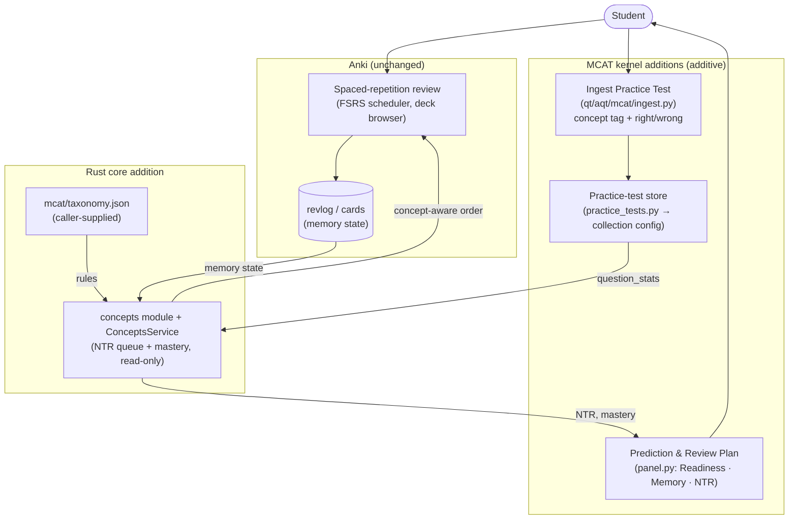

# Anki: Architecture

## Current Architecture

Anki's architecture relies on 4 main parts:

- **Rust Backend (rslib)**: This controls the spaced repition engine, as well as the database and other intensive operations. It is written in Rust for performance and type safety.
- **Python Bridge and Library (pylib / rsbridge)** : It is the bridge between the Python GUI frontend and the Rust backend, acting as a library wrapping the Rust code so Python can call it.
- **GUI Framework (aqt / ts)** : Anki's user interface consists of the PyQt interface on the desktop app, and the web technologies (TypeScript, HTML, and Svelte) for the interactive study and editor screens.
- **Protocol Buffers**: Anki uses Protobuf to standardize and safely pass complex data objects between the Rust backend and its various client interfaces.

Storage is done locally, with flashcard data, metadata, and scheduling histories being stored in SQLite databases (represented as .apkg files). Users can sync their SQLite collections with official AnkiWeb servers.

### Diagram

```mermaid
%% Anki — Current Architecture
%% Derived from docs/architecture.md, docs/language_bridge.md, docs/protobuf.md
%% and the repository layout (proto/, rslib/, pylib/, qt/, ts/).
%%
%% Key idea: Anki is layered. Each layer may make RPCs to the layer below it.
%% The Rust core never calls up into Python/TS (except outbound network sync).
%% Protobuf definitions in proto/ are the contract that binds the layers.

flowchart TB

    user(["User"])

    %% ============================================================
    %% GUI LAYER — Qt (Python) + Web (TypeScript/Svelte)
    %% ============================================================
    subgraph GUI["GUI Layer"]
        direction TB

        subgraph QT["Qt Desktop GUI — qt/aqt/ (import aqt)"]
            direction TB
            mw["Main window, dialogs,\nreviewer, deck options"]
            mediasrv["mediasrv.py\n(local HTTP server +\nFrontendService impl)"]
            webview["Qt WebView\n(embeds web pages)"]
        end

        subgraph WEB["Web Frontend — ts/ + qt/aqt/data/web/"]
            direction TB
            svelte["Svelte / TypeScript components\n(ts/routes, ts/reviewer,\nts/editor, ts/lib)"]
            gen_be["@generated/backend\n(typed RPC client)"]
            gen_pb_ts["@generated/anki/*_pb\n(protobuf-es types)"]
        end
    end

    %% ============================================================
    %% LIBRARY LAYER — Python (pylib)
    %% ============================================================
    subgraph PYLIB["Library Layer — pylib/anki/ (import anki)"]
        direction TB
        col["Collection API\n(col.decks, col.cards,\ncol.notes, col.sched, ...)"]
        backend_py["_backend.py\n(snake_case methods,\none per protobuf RPC)"]
        pb2["generated *_pb2.py\n(protobuf types)"]
        rsbridge["rsbridge\n(PyO3 native module\nwrapping rslib)"]
    end

    %% ============================================================
    %% CORE LAYER — Rust (rslib)
    %% ============================================================
    subgraph RSLIB["Core Rust Layer — rslib/"]
        direction TB
        services["Service impls\n(DecksService, CardsService,\nSchedulerService, ...)"]
        domain["Domain logic\n(scheduler, search, notetype,\ncard_rendering, import_export,\nmedia, stats, sync)"]
        storage["storage/\n(SQLite collection .anki2)"]
        sync_client["sync client\n(outbound HTTP)"]
    end

    %% ============================================================
    %% PROTOBUF CONTRACT
    %% ============================================================
    subgraph PROTO["Protobuf Contract — proto/anki/"]
        direction TB
        proto_defs["Service & message defs\n(backend.proto, decks.proto,\nscheduler.proto, frontend.proto, ...)"]
    end

    %% ============================================================
    %% EXTERNAL
    %% ============================================================
    subgraph EXT["External Services"]
        direction TB
        ankiweb["AnkiWeb /\nself-hosted Sync Server\n(rslib/sync, Docker)"]
    end

    db[("Collection file\n.anki2 (SQLite)\n+ media")]

    %% ---------------- Edges: user interaction ----------------
    user --> mw
    user --> svelte

    %% ---------------- GUI internal wiring ----------------
    mw --> webview
    webview -->|loads pages over HTTP| mediasrv
    mediasrv -->|serves| svelte
    svelte --> gen_be
    gen_be -.->|uses types| gen_pb_ts

    %% Web -> Python FrontendService (RPC over HTTP POST)
    gen_be -->|"RPC (HTTP POST)"| mediasrv

    %% Web -> Rust backend RPCs (routed via backend)
    gen_be -->|"backend RPCs"| col

    %% Python GUI -> Python library
    mw -->|"col.decks.new_deck()"| col

    %% Avoided/rare: Python -> TypeScript via web.eval
    mw -.->|"web.eval / evalWithCallback\n(call into JS, avoid when possible)"| svelte

    %% ---------------- Library layer wiring ----------------
    col -->|delegates to| backend_py
    backend_py -->|uses types| pb2
    backend_py -->|FFI call| rsbridge
    rsbridge -->|invokes| services

    %% ---------------- Core layer wiring ----------------
    services --> domain
    domain --> storage
    storage --> db
    domain --> sync_client
    sync_client -->|sync RPCs| ankiweb

    %% ---------------- Protobuf is the shared contract ----------------
    proto_defs -.->|generates| gen_pb_ts
    proto_defs -.->|generates| gen_be
    proto_defs -.->|generates| pb2
    proto_defs -.->|generates| services
    proto_defs -.->|"FrontendService impl"| mediasrv

    %% ---------------- Styling ----------------
    classDef gui fill:#e3f2fd,stroke:#1565c0,color:#0d47a1;
    classDef lib fill:#e8f5e9,stroke:#2e7d32,color:#1b5e20;
    classDef core fill:#fff3e0,stroke:#e65100,color:#bf360c;
    classDef proto fill:#f3e5f5,stroke:#6a1b9a,color:#4a148c;
    classDef ext fill:#eceff1,stroke:#455a64,color:#263238;
    classDef store fill:#fce4ec,stroke:#ad1457,color:#880e4f;

    class mw,mediasrv,webview,svelte,gen_be,gen_pb_ts gui;
    class col,backend_py,pb2,rsbridge lib;
    class services,domain,storage,sync_client core;
    class proto_defs proto;
    class ankiweb ext;
    class db store;
```

## New Architecture

This fork is the **kernel** of an MCAT study tool, not an all-in-one app. The guiding
constraint is: **leave Anki's architecture intact** and add the smallest set of pieces that turn
review history + the student's own practice tests into predictions and recommendations.

Three additions sit on top of the layers above, all additive:

1. **Concept/NTR engine (Rust core, `rslib/src/concepts/`).** A new, self-contained module and a
   new protobuf service (`proto/anki/concepts.proto` → `ConceptsService`) exposing two read-only
   RPCs: `ConceptAwareQueue` (re-orders due cards by `topic_weight × weakness`) and `ConceptMastery`
   (per-concept recall + NTR). It reads a caller-supplied taxonomy and optional per-concept
   `question_stats`; it never mutates cards, FSRS intervals, or the revlog, so undo and
   collection-integrity guarantees still hold. Because it lives in the shared Rust core, it ships to
   both desktop and any AnkiDroid-based phone build unchanged.

2. **Practice-test ingestion (Python/Qt, `qt/aqt/mcat/ingest.py` + `practice_tests.py`).** The
   kernel's one **input**. The student uploads/annotates the practice tests they already took —
   concept tag + right/wrong per question, via CSV import or manual entry. Aggregated per-concept
   tallies are stored in the collection config and handed to the two RPCs above as `question_stats`,
   blending ingested-test performance into NTR. Deterministic, no AI, no PDF/OCR parsing.

3. **Prediction & recommendations panel (Python/Qt, `qt/aqt/mcat/panel.py`, backed by
   `memory_score.py` + `readiness.py` + `integration.py`).** The kernel's **output**: three
   separate, never-blended surfaces — a projected MCAT **Readiness** score (from ingested tests), an
   honest FSRS **Memory** score (with a give-up rule + coverage map), and the per-concept **NTR**
   recommendations chart. Reached directly from the Tools menu.

The taxonomy + coverage map live in `mcat/` (fork data; `taxonomy.json`, `coverage.py`), decoupled
from the engine (passed in per request). What is **not** here, by design: no in-app quizzing/question
bank, no lessons viewer, no onboarding, and no all-in-one dashboard/home hub — Anki opens normally to
its deck list.


